# Product Audit — QuranAtlas

## Overview

A structured, multi-dimensional audit that spawns 7 parallel specialist subagents, each scoring their dimension 0-10 against a core checklist with code-level evidence. An orchestrator cross-analyzes all reports, verifies findings, calculates a weighted health score, and generates a prioritized recovery plan with a gate decision.

**Core principle:** Accuracy over completeness. A correct audit with 12 verified findings is worth more than 22 findings with 5 fabricated. No score without code-level evidence.

## When to Use

- User says "run a product audit", "health check", "codebase assessment"
- User asks about readiness for a new phase or release
- User wants a structured multi-dimensional analysis
- User asks "how healthy is this codebase?" or "what needs fixing?"

**Do NOT use for:** Single-file reviews, PR reviews, or quick "is this OK?" questions. Use Full Audit for first-time or periodic assessment. Use Follow-Up Audit to verify fixes after a full audit.

## The Iron Law

**Full Audit: NO audit without all 7 dimensions.** A security issue may also be a reliability issue. Your job is the complete picture.

**Follow-Up Audit:** Re-audit only dimensions that had P0/P1 findings in a previous full audit. Produces a delta report. See "Follow-Up Audit Mode" section below.

**No exceptions to full audit:**
- Not for "quick passes" — quick passes miss cross-dimensional issues
- Not for "just one dimension" — isolated audits create blind spots
- Not for "everything else is fine" — that's exactly what you need to verify
- Not for "we're in a hurry" — a partial audit is worse than no audit (false confidence)

## Full Audit Flow

### Step 0: Pre-Audit Setup

Before spawning subagents:

1. Run `mkdir -p .tmp/audit-results` to create the output directory
2. Capture `git rev-parse --short HEAD` — this is the commit being audited
3. Read `docs/product-info.md` and `docs/tech-stack.md` — the orchestrator needs product context to validate subagent reports later
4. Check `docs/audit/` for previous audit reports — if one exists, note it for the delta section

### Step 1: Spawn 7 Subagents in Parallel

Spawn all 7 simultaneously — do NOT wait for one to finish before starting the next. Each subagent gets the prompt template from `references/subagent-prompt-template.md` with the dimension-specific checklist inserted and the correct spec list from the dimension-to-spec mapping table in that template.

**Dimension-to-slug mapping:**

| Dimension | Slug | Checklist File |
|-----------|------|----------------|
| Functional correctness | functional-correctness | checklists/functional-correctness.md |
| Security | security | checklists/security.md |
| Reliability | reliability | checklists/reliability.md |
| Performance | performance | checklists/performance.md |
| Architecture | architecture | checklists/architecture.md |
| Testability | testability | checklists/testability.md |
| Observability | observability | checklists/observability.md |

**Timeout:** Allow up to 120 seconds per subagent (checklists have 18-22 items each).

### Step 2: Handle Failures

```dot
digraph failure_recovery {
    rankdir=LR;
    "Subagent completes?" [shape=diamond];
    "Collect report" [shape=box];
    "Timed out or failed?" [shape=diamond];
    "Respawn with core-only prompt" [shape=box];
    "Second attempt succeeds?" [shape=diamond];
    "Flag dimension as incomplete" [shape=box];
    "3+ dimensions incomplete?" [shape=diamond];
    "ABORT audit — tell user" [shape=box, style=bold];
    "Proceed with available reports" [shape=box];

    "Subagent completes?" -> "Collect report" [label="yes"];
    "Subagent completes?" -> "Timed out or failed?" [label="no"];
    "Timed out or failed?" -> "Respawn with core-only prompt" [label="yes"];
    "Respawn with core-only prompt" -> "Second attempt succeeds?";
    "Second attempt succeeds?" -> "Collect report" [label="yes"];
    "Second attempt succeeds?" -> "Flag dimension as incomplete" [label="no"];
    "Flag dimension as incomplete" -> "3+ dimensions incomplete?";
    "3+ dimensions incomplete?" -> "ABORT audit — tell user" [label="yes"];
    "3+ dimensions incomplete?" -> "Proceed with available reports" [label="no"];
}
```

**Rules:**
- If a subagent fails or times out, respawn it with a simplified prompt focusing only on core checklist items
- If a subagent fails twice, flag that dimension as incomplete in the report
- If 3+ dimensions are incomplete, ABORT the audit and tell the user — partial results are misleading
- If 1-2 dimensions are incomplete, proceed but prominently flag the gaps

### Step 3: Cross-Analyze Findings

Read all completed reports and perform:

1. **Deduplication** — If the same finding (same file, same issue) appears in multiple dimensions, merge into a single entry. Tag it as "cross-dimensional" and note which dimensions flagged it. Use the highest severity assigned by any dimension.

2. **Overlapping issues** — Same root cause manifesting differently across dimensions. Group these under a systemic pattern.

3. **Contradictions** — One dimension scores high while another finds critical issues in the same area. The lower score wins — evidence of problems overrides absence of evidence.

4. **Systemic patterns** — 3+ dimensions flag the same module or pattern → architecture-level concern for cross-cutting observations.

5. **Shallow report detection** — If a subagent marked 0 items as `fail`, has 0 supplementary findings, AND reported confidence as "medium" or "low" — flag this report as potentially shallow. Note it in the report.

6. **Severity consistency** — ALL findings must use ONLY P0/P1/P2/P3 labels. Convert any other labels.

### Step 4: Orchestrator Verification (MANDATORY)

Before calculating scores, the orchestrator MUST verify:

1. **Evidence spot-check** — For ALL P0 and P1 findings: read the actual file:line referenced. Confirm the code exists and says what the subagent claims. If a finding cites code that doesn't exist or doesn't demonstrate the claimed issue, **downgrade or remove** the finding.

2. **Score-finding consistency** — If a subagent gave a score of 8+ but reported a P1 finding, flag the inconsistency. An 8+ score with a P1 finding is suspicious — either the score is inflated or the P1 is overstated.

3. **Math verification** — Recalculate all weighted scores. Do not trust subagent arithmetic.

4. **Open questions aggregation** — Collect all `open_questions` from subagent reports. These go in the report's Open Questions section.

5. **Not-assessable audit** — If any dimension has >50% items as `not-assessable`, note this prominently. The dimension score is based on a small sample and may not be representative.

### Step 5: Calculate Weighted Scores

Use `references/scoring-model.md` for weights, formula, health bands, severity definitions, and not-assessable scoring rules.

### Step 6: Generate Recovery Plan

Prioritize by severity, then by dimension weight (highest first):

1. **Phase 1: Stop the bleeding** — All P0 findings (with effort estimate: S/M/L)
2. **Phase 2: Stabilize** — All P1 findings (with effort estimate: S/M/L)
3. **Phase 3: Strengthen** — All P2 findings (grouped by theme)
4. **Phase 4: Optimize** — All P3 findings (grouped by theme)

**Effort estimates:** S = under 1 hour, M = 1 hour to 1 day, L = more than 1 day.

Each Phase 1 and Phase 2 finding must include: what to fix, where (file:line), why it matters, how to fix, and effort estimate.

### Step 7: Write the Report

Use `references/report-template.md`. Save to: `docs/audit/YYYY-MM-DD-product-health-report.md`

### Step 8: Gate Decision

Based on the audit results, declare one of:

- **PASS** — No P0 findings. P1 findings are acceptable for current phase. Ship with confidence.
- **CONDITIONAL** — P0 findings exist but are fixable. List conditions that must be met before shipping.
- **FAIL** — Systemic P0 issues, multiple critical dimensions below 4.0, or 3+ dimensions with P1 findings. Do not ship.

---

## Follow-Up Audit Mode

Use when the user wants to verify fixes after a previous full audit.

**Prerequisites:**
- A previous full audit report must exist in `docs/audit/`
- The user specifies which report to compare against (or use the most recent)

**Process:**
1. Read the previous audit report
2. Identify dimensions that had P0 or P1 findings
3. Re-audit ONLY those dimensions using the same checklists and subagent prompt
4. For each previously-reported P0/P1 finding: verify whether it is now resolved, still present, or partially addressed
5. Produce a delta report (not a full report) with:
   - Previous score → current score per re-audited dimension
   - Findings resolved (with evidence of the fix)
   - Findings still open
   - New findings discovered during re-audit
   - Updated gate decision

**Follow-up audit does NOT:**
- Produce a new overall weighted health score (only the full audit does)
- Re-audit dimensions that had no P0/P1 findings
- Replace the need for periodic full audits

---

## Rationalization Table

| Excuse | Reality |
|--------|---------|
| "Just a quick pass" | Quick passes miss cross-dimensional issues. You need the full picture. |
| "Everything else is fine" | That's exactly what you need to verify, not assume. |
| "Not enough time for all 7" | A partial audit gives false confidence. All 7 or don't call it an audit. |
| "This dimension looks clean" | "Looks clean" without code-level evidence is not an audit. |
| "The user only asked about X" | The user may not know about hidden risks. Complete picture is your job. |
| "I'll do the others later" | Later never comes. Do all 7 now. |
| "Severity labels don't matter" | Inconsistent labels break recovery plan prioritization. ONLY P0-P3. |
| "I verified the findings mentally" | Mental verification is not verification. Read the actual file:line. Step 4 is mandatory. |
| "The subagent seems thorough" | Trust but verify. Subagents hallucinate. Spot-check ALL P0/P1 evidence. |

## Red Flags — STOP and Restart

- Skipping any of the 7 dimensions (full audit)
- Giving a score without code-level evidence (file:line references)
- Using ANY severity labels other than P0/P1/P2/P3
- Not calculating the weighted overall score
- Not including cross-dimensional analysis
- Writing a narrative report instead of structured findings
- Proceeding with 3+ missing dimension reports
- Skipping the orchestrator verification step (Step 4)
- Not reading file:line references for P0/P1 findings
- Publishing a gate decision without completing all prior steps

## Common Mistakes

1. **Shallow analysis** — Reading file names without reading file contents. Fix: Actually read source code.
2. **Inventing findings** — Fabricating issues to appear thorough. Fix: Zero supplementary findings is acceptable. Accuracy > completeness.
3. **No evidence** — "Security looks good" without citing files. Fix: Every score needs file references.
4. **Wrong severity** — Calling a P3 a P1. Fix: Use severity definitions from scoring-model.md exactly.
5. **No cross-analysis** — Concatenating 7 reports without synthesizing. Fix: Look for overlaps, contradictions, systemic patterns.
6. **Stale context** — Auditing against assumptions instead of reading current code and docs. Fix: Read `docs/product-info.md` and `docs/tech-stack.md` first.
7. **Marking stubs as failures** — Phase 2/3 modules that don't exist yet are `not-assessable`, not `fail`.
8. **Skipping verification** — Trusting subagent findings without reading the cited code. Fix: Step 4 is mandatory for all P0/P1.
9. **No deduplication** — Same finding counted multiple times across dimensions. Fix: Merge duplicates in Step 3.
