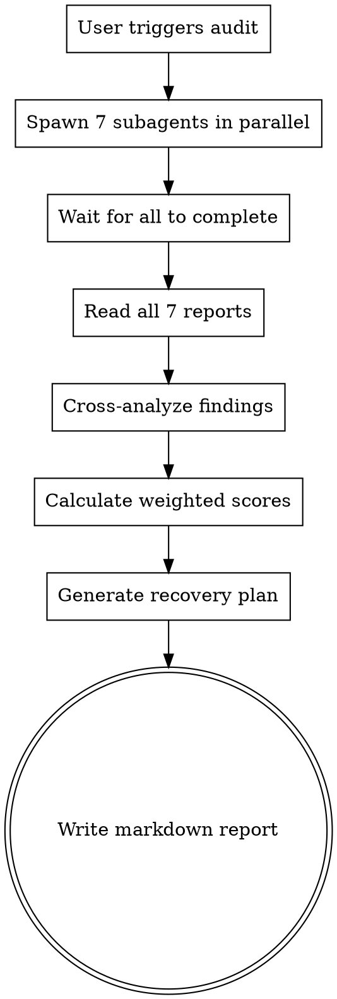

# Product Audit — QuranAtlas

## Overview

A structured, multi-dimensional audit that spawns 7 parallel specialist subagents, each scoring their dimension 0-10 against a core checklist plus supplementary checks. An orchestrator cross-analyzes all reports, calculates a weighted health score, and generates a prioritized markdown recovery plan.

**Core principle:** Every audit must be systematic, evidence-based, and actionable. No dimension is skipped. No score is given without code-level evidence.

## When to Use

- User says "run a product audit", "health check", "codebase assessment"
- User asks about readiness for a new phase or release
- User wants a structured multi-dimensional analysis
- User asks "how healthy is this codebase?" or "what needs fixing?"

**Do NOT use for:** Single-file reviews, PR reviews, or quick "is this OK?" questions. This skill is for full codebase audits.

## The Iron Law

**NO audit without all 7 dimensions.** Even if the user says "just check X", you MUST run all 7 dimensions. The user may not know that a security issue is also a reliability issue. Your job is to give the complete picture.

**No exceptions:**
- Not for "quick passes" — quick passes miss critical cross-dimensional issues
- Not for "just one dimension" — isolated audits create blind spots
- Not for "everything else is fine" — that's exactly what you need to verify
- Not for "we're in a hurry" — a partial audit is worse than no audit (false confidence)

## Core Flow



## Step 1: Spawn 7 Subagents in Parallel

Each subagent receives the same base instructions below. Spawn all 7 simultaneously — do NOT wait for one to finish before starting the next.

**Subagent prompt template:**

```
You are the [DIMENSION] auditor for QuranAtlas.

## Project Context
QuranAtlas is a vanilla JS PWA for reading the Quran on mobile devices.
- Source: /Users/omarduadu/Desktop/Dev/QuranAtlas/src/
- Tech: Vanilla JS, Vite, PWA with service worker, IndexedDB
- Architecture: Pub/sub event bus, hash-based routing, strict module boundaries
- Feature modules: reader/, nav/, marks/, review/, settings/, about/
- Cross-cutting: core/, data/, safety/, a11y/
- 12 unit test files, Storybook stories, no E2E tests yet

## Your Task

1. Read the core checklist for your dimension (see below)
2. Analyze the relevant source files in the codebase
3. Evaluate each checklist item: Pass / Fail / Partial with code-level evidence
4. Add supplementary checks based on what you find in the code
5. Score 0-10 with detailed justification
6. Report all findings with P0/P1/P2/P3 severity (NO EXCEPTIONS - use ONLY these labels)

## Core Checklist for [DIMENSION]

[Insert dimension-specific checklist from checklists/ directory]

## Output Format (save as JSON)

Save your report to: .tmp/audit-results/[dimension-slug].json

{
  "dimension": "[Dimension Name]",
  "score": 0-10,
  "score_justification": "detailed paragraph explaining why this score",
  "core_checklist": [
    {"item": "checklist item text", "status": "pass|fail|partial", "evidence": "file:line + description"}
  ],
  "supplementary_findings": [
    {"description": "what you found", "severity": "P0|P1|P2|P3", "location": "file:line or N/A", "evidence": "code snippet or explanation"}
  ],
  "top_3_risks": ["risk 1", "risk 2", "risk 3"],
  "top_3_recommendations": ["rec 1", "rec 2", "rec 3"]
}

## Severity Definitions (MUST USE EXACTLY THESE)
- P0 (Blocker): Data loss, wrong verse text, XSS vector, broken navigation. Blocks release.
- P1 (Critical): Broken feature, offline failure, security gap. Fix before next release.
- P2 (Warning): Degrades experience, tech debt, maintainability issue. Plan for sprint.
- P3 (Info): Improvement opportunity, nice-to-have. Backlog candidate.

## Scoring Guide
- 0-2: Non-existent or fundamentally broken
- 3-4: Major gaps, unreliable
- 5-6: Functional but significant issues
- 7-8: Solid with minor improvements needed
- 9-10: Excellent, best-practice level
```

**Dimension-to-slug mapping:**

| Dimension | Slug | Checklist File |
|-----------|------|----------------|
| Functional correctness | functional-correctness | checklists/functional-correctness.md |
| Security | security | checklists/security.md |
| Reliability | reliability | checklists/reliability.md |
| Performance | performance | checklists/performance.md |
| Architecture | architecture | checklists/architecture.md |
| Testability | testability | checklists/testability.md |
| Observability | observability | checklists/observability.md |

## Step 2: Wait and Collect All Reports

Wait for all 7 subagents to complete. If any subagent fails or times out, re-spawn it with a simplified prompt focusing only on core checklist items — do NOT proceed with missing dimensions.

## Step 3: Cross-Analyze Findings

Read all 7 JSON reports and look for:

1. **Overlapping issues** — same finding appearing in multiple dimensions (e.g., a reliability issue that's also security). Note these as cross-cutting risks.
2. **Contradictions** — one dimension scores high while another finds critical issues in the same area. Investigate and reconcile.
3. **Systemic patterns** — e.g., if multiple dimensions flag `reader/index.js` as too large, that's an architecture-level concern.
4. **Gaps** — dimensions that found nothing significant may have been too shallow. Verify by spot-checking their evidence.
5. **Severity consistency** — verify ALL findings use ONLY P0/P1/P2/P3 labels. Convert any other severity labels (HIGH/MEDIUM/LOW, etc.) to equivalent P0-P3 based on definitions.

## Step 4: Calculate Weighted Scores

Use the scoring model from `references/scoring-model.md`.

**Weights:**

| Dimension | Weight |
|-----------|--------|
| Functional correctness | 5 |
| Security | 5 |
| Reliability | 5 |
| Performance | 4 |
| Architecture | 4 |
| Testability | 3 |
| Observability | 1 |
| **Total** | **27** |

**Formula:**
```
weighted_score = sum(dimension_score × weight) / 27
```

**Health status bands:**
- 8.0-10.0: Healthy — ship with confidence
- 6.0-7.9: Caution — fix P0s before shipping
- 4.0-5.9: At risk — significant work needed
- 0.0-3.9: Critical — do not ship

## Step 5: Generate Recovery Plan

Prioritize by severity, then by weight:

1. **Phase 1: Stop the bleeding** — All P0 findings, ordered by dimension weight (highest first)
2. **Phase 2: Stabilize** — All P1 findings, ordered by dimension weight
3. **Phase 3: Strengthen** — All P2 findings, ordered by dimension weight
4. **Phase 4: Optimize** — All P3 findings, ordered by dimension weight

Each finding in the recovery plan must include:
- What to fix
- Where (file:line)
- Why it matters (impact)
- How to fix (specific recommendation)

## Step 6: Write the Report

Use the report template from `references/report-template.md`.

Save to: `docs/audit/YYYY-MM-DD-product-health-report.md`

The report must include:
- Executive summary with overall weighted score and health status
- Dimension scores table (score, weight, weighted, status)
- All P0 and P1 findings with full detail
- Prioritized recovery plan (4 phases)
- Cross-cutting observations
- Summary of strengths

## Orchestrator Improvements (Addressing Timeout Issues)

To prevent orchestrator timeouts:
1. Set individual timeouts for each subagent (60 seconds)
2. If a subagent times out, respawn it with a focused prompt on core checklist only
3. If a subagent fails twice, proceed with available reports but flag missing dimension in report
4. Generate report incrementally as reports arrive rather than waiting for all
5. Use lightweight JSON parsing to minimize processing overhead

## Rationalization Table

Agents under pressure will try to skip dimensions or go shallow. Here's what they say and why it's wrong:

| Excuse | Reality |
|--------|---------|
| "Just a quick pass" | Quick passes miss cross-dimensional issues. A security flaw might also be a reliability risk. You need the full picture. |
| "Everything else is fine" | That's exactly what you need to verify, not assume. Unverified assumptions cause production incidents. |
| "Not enough time for all 7" | A partial audit gives false confidence. Better to have no audit than a misleading one. |
| "This dimension looks clean" | "Looks clean" without code-level evidence is not an audit. Score with justification or re-examine. |
| "The user only asked about X" | The user may not know about hidden risks. Your job is the complete picture, not just what was requested. |
| "I'll do the others later" | Later never comes under pressure. Do all 7 now or don't call it an audit. |
| "Severity labels don't matter" | Inconsistent severity labels break the recovery plan prioritization. ONLY use P0/P1/P2/P3. |

## Red Flags — STOP and Restart

- Skipping any of the 7 dimensions
- Giving a score without code-level evidence (file:line references)
- Using P0-P3 inconsistently (e.g., calling something P0 that's actually P3)
- Using ANY severity labels other than P0/P1/P2/P3
- Not calculating the weighted overall score
- Not including cross-dimensional analysis
- Writing a narrative report instead of structured findings
- Proceeding with missing subagent reports without flagging the issue

**All of these mean: Restart the audit with all 7 dimensions.**

## Common Mistakes

1. **Shallow analysis** — Reading file names without reading file contents. Fix: Actually read the source code for each dimension's relevant files.
2. **Inventing dimensions** — Adding dimensions not in the core 7 (e.g., "Accessibility", "Code Quality"). Fix: Stick to the 7 defined dimensions. Supplementary observations go under the closest matching dimension.
3. **No evidence** — "Security looks good" without citing specific files, patterns, or gaps. Fix: Every score needs a paragraph of justification with file references.
4. **Wrong severity** — Calling a P3 (nice-to-have) a P1 (critical). Fix: Use the severity definitions exactly. P0 = blocks release, P1 = fix before next release, P2 = plan for sprint, P3 = backlog.
5. **No cross-analysis** — Just concatenating 7 reports without synthesizing. Fix: Look for overlaps, contradictions, and systemic patterns across dimensions.
6. **Severity inconsistency** — Using labels like HIGH/MEDIUM/LOW instead of P0/P1/P2/P3. Fix: ONLY use P0/P1/P2/P3 labels as defined.
7. **Orchestrator timeout** — Waiting too long for slow subagents. Fix: Implement timeouts and respawn with simplified prompts.