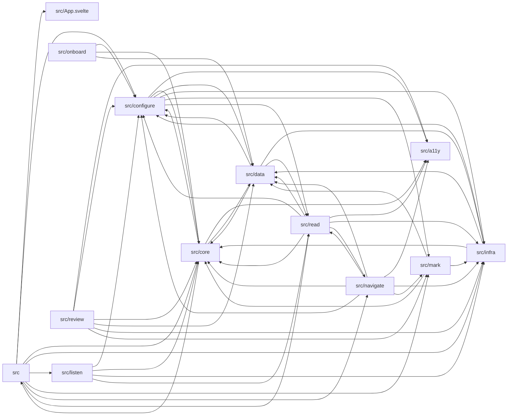

# Module graph

> AUTO-GENERATED from `src/**/*.{ts,js,svelte}` import statements. Run `pnpm run docs` to regenerate.

Top-level src directories: **13**.

## Mermaid (top-level)

<!-- AUTO-GENERATED:mermaid START -->

<!-- AUTO-GENERATED:mermaid END -->

## Per-directory

<!-- AUTO-GENERATED:dirs START -->
### `src`

- **Imports from:** `src/App.svelte`, `src/configure`, `src/core`, `src/infra`, `src/listen`, `src/mark`, `src/navigate`, `src/read`
- **Imported by:** `src/core`

### `src/App.svelte`

- **Imports from:** _(none)_
- **Imported by:** `src`

### `src/a11y`

- **Imports from:** _(none)_
- **Imported by:** `src/configure`, `src/core`, `src/navigate`, `src/read`, `src/review`

### `src/configure`

- **Imports from:** `src/a11y`, `src/core`, `src/data`, `src/infra`, `src/mark`, `src/read`
- **Imported by:** `src`, `src/core`, `src/data`, `src/infra`, `src/listen`, `src/navigate`, `src/onboard`, `src/read`, `src/review`

### `src/core`

- **Imports from:** `src`, `src/a11y`, `src/configure`, `src/data`
- **Imported by:** `src`, `src/configure`, `src/data`, `src/infra`, `src/listen`, `src/mark`, `src/navigate`, `src/onboard`, `src/read`, `src/review`

### `src/data`

- **Imports from:** `src/configure`, `src/core`, `src/infra`, `src/read`
- **Imported by:** `src/configure`, `src/core`, `src/infra`, `src/mark`, `src/navigate`, `src/onboard`, `src/read`, `src/review`

### `src/infra`

- **Imports from:** `src/configure`, `src/core`, `src/data`
- **Imported by:** `src`, `src/configure`, `src/data`, `src/listen`, `src/mark`, `src/navigate`, `src/read`, `src/review`

### `src/listen`

- **Imports from:** `src/configure`, `src/core`, `src/infra`, `src/read`
- **Imported by:** `src`

### `src/mark`

- **Imports from:** `src/core`, `src/data`, `src/infra`
- **Imported by:** `src`, `src/configure`, `src/navigate`, `src/review`

### `src/navigate`

- **Imports from:** `src/a11y`, `src/configure`, `src/core`, `src/data`, `src/infra`, `src/mark`, `src/read`
- **Imported by:** `src`, `src/read`

### `src/onboard`

- **Imports from:** `src/configure`, `src/core`, `src/data`
- **Imported by:** _(none)_

### `src/read`

- **Imports from:** `src/a11y`, `src/configure`, `src/core`, `src/data`, `src/infra`, `src/navigate`
- **Imported by:** `src`, `src/configure`, `src/data`, `src/listen`, `src/navigate`

### `src/review`

- **Imports from:** `src/a11y`, `src/configure`, `src/core`, `src/data`, `src/infra`, `src/mark`
- **Imported by:** _(none)_

<!-- AUTO-GENERATED:dirs END -->
