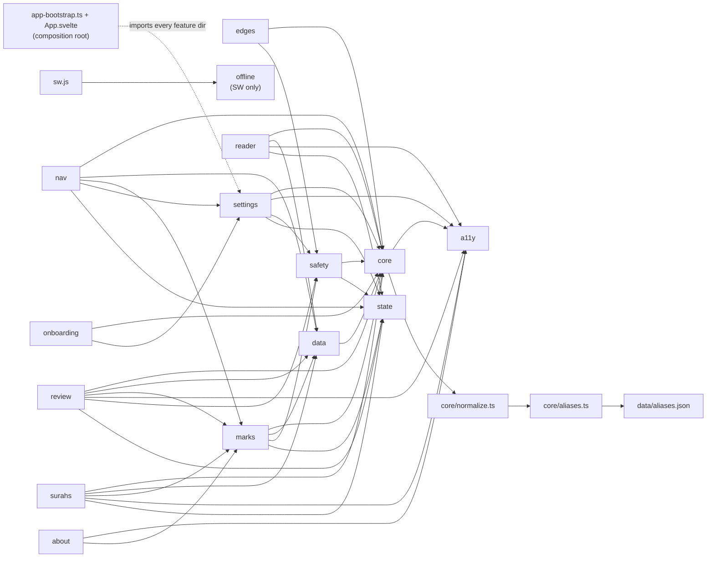

# Module Dependency Graph

Every top-level directory under `src/`, which files live in it, and which other directories it imports from / is imported by. Use this to answer "if I change X, what else breaks?" without grepping the whole tree.

Everything in `src/` is either TypeScript (`.ts`) or Svelte 5 (`.svelte`/`.svelte.ts`) with a handful of untyped JS leaves called out per directory. `src/sw.js` and `src/offline/*` stay vanilla JS by design.

**Key insight:** `core/` is the trunk, `a11y/` is a lone leaf, and `app-bootstrap.ts` is the composition root — the only file that cuts upward through layers (see `architecture.md`). `src/App.svelte` + `src/app.ts` are the entry pair: `app.ts` mounts `App.svelte` into `#app`; `App.svelte` owns persistent overlays, route component mounting, and the `$effect`s that watch `reader.currentSurahNum`.

## Mermaid overview

`src/app-bootstrap.ts` imports from `settings`, `nav`, `marks`, `about`, `safety`, `onboarding`, `data` as part of wiring. `src/App.svelte` additionally mounts the persistent overlay components and holds the `reader.currentSurahNum` effect. Together they are the composition root — no other file under `core/` or the feature dirs reaches upward. The composition-root dependency is drawn dashed so the diagram stays readable.

## Per-directory inventory

### `a11y/`
- **Files:** `announcer.ts`
- **Imports from:** —
- **Imported by:** `about`, `core/quota-banner.svelte`, `marks/Editor.svelte`, `reader`, `review`, `settings/clear-data.ts`, `surahs`
- **Role:** Screen-reader live-region announcer (`announce(message)`).

### `about/`
- **Files:** `About.svelte`, `pwa-install.ts`
- **Imports from:** `a11y`, `marks`
- **Imported by:** `app-bootstrap.ts` *(lazy-loaded for `#/about` route)*
- **Role:** About page Svelte component + PWA install prompt capture/handling.

### `core/`
- **Files:** `constants.ts`, `db.ts`, `events.ts`, `logger.ts`, `normalize.ts`, `aliases.ts`, `seeds.ts`, `quota-banner.svelte`, `router.ts`, `sw-update-poll.ts`, `tag-colors.ts`, `ui.svelte`, `ui-bridge.ts`
- **Imports from:**
  - `core/quota-banner.svelte` → `a11y`
  - `core/ui.svelte` → emits `MARKS_UNDO` via the bus; no feature-dir imports
  - `core/normalize.ts` → `core/aliases.ts`
  - `core/aliases.ts` → `data/aliases.json`
  - Every other file: none outside core
- **Imported by:** **every feature directory** — this is the trunk.
- **Role:** Cross-cutting primitives. `db.ts` (IDB + strict `StoreRecords` types + `LayerName` / `LAYER_NAMES` / `MarkRecord`), `events.ts` (pub/sub + typed `EventPayloads`), `router.ts` (hash routing), `constants.ts` (Events enum + payload typedefs + shared constants), `logger.ts` (noop wrapper in tests, console in prod), `normalize.ts` (canonicalization pipeline — `normalize()` + `canonicalize()`), `aliases.ts` (alias map + `excludeFromAliasing` guard), `ui.svelte` (undo toast) + `ui-bridge.ts` (imperative `showUndoToast()`), `tag-colors.ts` (deterministic tag-color mapping), `quota-banner.svelte` (storage warnings).
- **CSS:** All styles live under `src/styles/` (entry `styles/index.css`). Tokens in `styles/tokens/{primitives,motion,semantic}.css`; shell rules in `styles/{reset,base,animations,utilities}.css`; per-surface files under `styles/surfaces/*.css`. Component → surface map:
  - `core/quota-banner.svelte` → `surfaces/quota-banner.css`
  - shared sheet + modal chrome → `surfaces/sheet.css` + `surfaces/modal.css` (context-scoped token inheritance roots; sheet-context redefines `--qa-text-primary`, `--qa-text-muted`, `--qa-text-dim`, `--qa-border-default` to on-sheet tokens)
  - app-shell layout + dock rail → `surfaces/app-shell.css` (only file allowed `:has()`)
  - `about/About.svelte` → `surfaces/about.css` (about-heading `:has()` rule lives in `app-shell.css`)
  - `onboarding/Onboarding.svelte` → `surfaces/onboarding.css` (theme-swatch hex retained as demo literals)
  - `surahs/{SurahList,SurahRow}.svelte` → `surfaces/surahs.css`
  - `nav/{AmbientDock,AmbientPill,CommandSheet,MarginHeader,NavDrawer,SurahProgress}.svelte` → `surfaces/nav.css`
  - `reader/{Reader,Verse,VerseTagPanel}.svelte` + imperative `edge-indicators.ts` class strings → `surfaces/reader.css` (VerseTagPanel owns the `.qa-vtp-*` block inside `surfaces/tag.css` — inline fast-tag panel)
  - `tag/{TagSheet,TagChip,VerseSpotlight}.svelte` → `surfaces/tag.css` (`color-mix()` surface policy exercised here; TagChip dot hue piped via `style:--qa-tag-chip-hue`)
  - `marks/{Editor,TagChip,TagLayerRegion}.svelte` → `surfaces/marks.css`
  - `review/{Hub,ReviewCard}.svelte` → `surfaces/review.css`
  - `settings/Panel.svelte` → `surfaces/settings.css`
  - `core/ui.svelte` undo toast + imperative `.qa-error-state` / `.qa-retry-btn` (used by `app-bootstrap.ts`, `core/router.ts`, `reader/Reader.svelte`) → `surfaces/toast.css`

  `.svelte` files contain no `<style>` blocks — enforced by `scripts/check-no-svelte-style.mjs`. `check-token-usage.mjs` reads `.svelte` `style:--X=` directives + `--X:` inline attribute declarations into the global token set so surface CSS can consume them.

### `data/`
- **Files:** `aliases.json`, `dataset.ts`, `offline.ts`, `surah-meanings.ts`
- **Imports from:** `core`
- **Imported by:** `marks`, `nav`, `reader`, `review`, `surahs`; `aliases.json` imported by `core/aliases.ts`
- **Role:** Corpus fetch + static data. `dataset.ts::getSurahs()` + `getSurah(n)` serve the surah index and full surah payloads (cache-first via service worker). `offline.ts` tracks activation state + dataset update flow (client side; the SW half lives in `src/offline/`). `surah-meanings.ts` is the static mapping of surah-number → name meaning. `aliases.json` is the seed alias map for the canonicalization pipeline.

### `edges/`
- **Files:** `store.ts`, `kinds.ts`
- **Imports from:**
  - `edges/store.ts` → `core/db`, `core/events`, `core/constants`, `core/logger`, `safety/sync`, `./kinds`
  - `edges/kinds.ts` → nothing (pure data/logic)
- **Imported by:** nothing at MVP (no UI surface yet — edge-creation UI is deferred; see `docs/context/future-work.md`)
- **Role:** Verse-to-verse typed relationship store. `kinds.ts` exports `EDGE_KIND_SEEDS` (14 seed kinds) and `inferDirectedFromKind()`. `store.ts` is the sole IDB writer for the `edges` store — computes `_canonKind` (simple ASCII lowercase) and auto-infers `directed` from `inferDirectedFromKind()`. Provides `createEdge`, `updateEdge`, `deleteEdge`, `getById`, `getAll`, `getByVerse`, `getByKindCanonical`.

### `bookmarks/`
- **Files:** `store.ts`, `indicator.ts`, `click-handler.ts`, `pulse.ts`, `BookmarksList.svelte`, `BookmarksPage.svelte`
- **Imports from:**
  - `bookmarks/store.ts` → `core/db`, `core/events`, `core/constants`, `core/logger`, `safety/sync`
  - `bookmarks/indicator.ts` → `./store`, `core/events`, `core/constants`, `state/settings.svelte`
  - `bookmarks/click-handler.ts` → `./store`, `core/logger`, `state/settings.svelte`, `state/tag-session.svelte`
  - `bookmarks/pulse.ts` → `core/events`, `core/constants`
  - `bookmarks/BookmarksList.svelte` → `./store`, `data/dataset`, `core/events`, `core/constants`, `state/settings.svelte`
  - `bookmarks/BookmarksPage.svelte` → `./BookmarksList.svelte`, `./store`, `core/events`, `core/constants`, `state/settings.svelte`, `a11y/announcer`
- **Imported by:** `app-bootstrap.ts` (init for indicator + click-handler + pulse), `nav/NavDrawer.svelte` (`BookmarksList`), `surahs/SurahList.svelte` (`getAllForRiwayah` for the surah-row star).
- **Role:** Riwayah-scoped verse bookmarks. `store.ts` is the sole IDB writer (CLAUDE.md Rule 5). `click-handler.ts` is a global `document.click` listener that toggles bookmarks on `.qa-verse-number` taps (skipped while `tagSession.quickbarOpen` to coexist with fast-tag). `indicator.ts` keeps an in-memory active-riwayah verseKey set and decorates verse-id glyphs (`qa-verse--bookmarked-glyph`). `pulse.ts` listens for `BOOKMARK_JUMP_LANDED` and pulses the landed verse cell for 1s. `BookmarksList.svelte` is shared between drawer Read>Bookmarks sub-tab and `BookmarksPage.svelte` (desktop `#/bookmarks` route).

### `marks/`
- **Files:** `Editor.svelte`, `TagLayerRegion.svelte`, `TagChip.svelte`, `editor-bridge.ts`, `long-press.ts`, `indicator.ts`, `store.ts`, `tags.js`
- **Imports from:** `core` (including `core/normalize.ts` for `canonicalize()`), `data`, `safety`, `state`
- **Imported by:** `about`, `app-bootstrap.ts`, `App.svelte`, `nav`, `reader` *(via app-bootstrap hooks)*, `review`, `surahs`
- **Role:** Marks CRUD + UI (Svelte 5). `store.ts` is the sole IDB writer (CLAUDE.md Rule 5) — takes `MarkInput` (raw layer arrays) and computes `_canon` internally via `canonicalize()`. `Editor.svelte` is the bottom-sheet component mounted persistently in `App.svelte`; `TagChip.svelte` renders individual chips; `long-press.ts` exposes the `longPress` Svelte action and `setupLongPress` wrapper; `editor-bridge.ts` provides `openEditor(verseKey)` for imperative callers; `indicator.ts` decorates bookmarked verses via event subscriptions; `tags.js` exposes the seed tag palette + `getAllUsedTags()` (delegates to `store.ts::getAllCanonicalValues('threads')`).

### `nav/`
- **Files:** `AmbientDock.svelte` (desktop left rail), `AmbientPill.svelte`, `MarginHeader.svelte` (mobile top nav, single-row 2026-04-25; center label tap is a no-op post-overhaul), `NavDrawer.svelte` (full-screen tabbed Surahs/Review surface on mobile; narrow side-panel on desktop; replaces MoreSheet), `EmptyRoute.svelte` (synthetic empty component for the mobile `#/surahs` redirect), `SurahProgress.svelte`, `CommandSheet.svelte`, `command-sheet-bridge.ts`, `nav-drawer-bridge.ts`, `swipe-gestures.ts` (pure helper for MarginHeader gestures), `reader-actions.js`, `shortcuts-sheet.js`
- **Imports from:** `core`, `data`, `marks`, `review` (parse-layer-query, for drawer review-tab routes), `settings`, `state` (incl. `state/tag-session.svelte.ts`, `state/surahs.svelte.ts`), `tag` (`session-bridge`), `a11y`
- **Imported by:** `src/App.svelte` (component mounts), `src/app-bootstrap.ts` (`reader-actions`, `EmptyRoute` for `#/surahs` mobile redirect), `reader/SurahHeader.svelte` (`SurahProgress`)
- **Role:** Navigation chrome + reader keyboard actions. `AmbientDock` = desktop (≥1180px) 56-px left edge rail. `MarginHeader` = mobile/tablet fixed top nav (single row 2026-04-25: hamburger · bilingual surah label · gear; tap is no-op post-overhaul). `NavDrawer` = full-screen tabbed surface on mobile (Surahs · Review tabs, sole entry to surah list and per-layer Review jumps), narrow side-panel on desktop. Drawer opened by hamburger / swipe-down / dock kebab via `nav-drawer-bridge::openNavDrawer(tab?)`. `SurahProgress` = juz/percent chip used in `SurahHeader`. Command sheet (⌘K) + drawer are Svelte 5 components. Bridge modules (`*-bridge.ts`) provide typed imperative open/close APIs. `swipe-gestures.ts` is a pure DOM-free helper for MarginHeader's left/right/down classifier. `reader-actions.js` backs the `j/k/[/]/Home/End/m` shortcuts by reading and writing the `reader` rune directly (no events). `shortcuts-sheet.js` is the in-reader shortcuts help sheet.

### `tag/`
- **Files:** `TagSheet.svelte` (deep sheet), `TagChip.svelte`, `TagModeToggle.svelte`, `VerseSpotlight.svelte`, `session-bridge.ts`
- **Imports from:** `core`, `data` (`tag-layers`), `marks` (`store`), `state` (`tag-session.svelte.ts`)
- **Imported by:** `App.svelte` (`TagSheet`), `nav/MarginHeader.svelte` (`beginFast`), `reader/VerseTagPanel.svelte` (state only; panel lives under `reader/`)
- **Role:** Fast-path tagging surfaces. Shares `tagSession` state with deep path. `session-bridge::beginFast(verseKey)` hydrates the session from any existing mark and flips `quickbarOpen` — the inline suggestions UI then renders inside the active verse via `reader/VerseTagPanel.svelte`. `openDeep` opens the deep sheet. Persistence still flows through `marks/store.ts` (single writer).

### `offline/`
- **Files:** `dataset-updater.js`, `manifest-fetcher.js`, `sha256-verifier.js`, `staging-cache.js`
- **Imports from:** other files inside `offline/` only
- **Imported by:** **`src/sw.js` only** — this is service-worker-side code, not bundled into the client app.
- **Role:** SW dataset-update pipeline: fetch manifest, stage in a separate cache, SHA-256 verify, promote to live cache.

### `onboarding/`
- **Files:** `Onboarding.svelte`, `OnboardingScreen.svelte`, `screens.ts`
- **Imports from:** `core`, `data`, `settings`
- **Imported by:** `app-bootstrap.ts` *(via dynamic import in `handleLaunchRestore` and route registration)*
- **Role:** First-run 6-screen walkthrough (Svelte component). `Onboarding.svelte` exports `isComplete()` and `markComplete()` from its module script for use by the boot-time redirect in `app-bootstrap.ts`. Writes `settings.onboardingComplete` and `settings['riwayah']` (via `settings/riwayah.ts::setRiwayah`). `screens.ts` is pure data (shortcut rows, sample chips). Riwayah card options and labels are defined inline in `Onboarding.svelte`.

### `reader/`
- **Files:** `Reader.svelte`, `Verse.svelte`, `SurahHeader.svelte`, `EdgeIndicator.svelte`, `PullToSwapIndicator.svelte`, `render-helpers.ts`, `chunked-append.ts`, `verse-scroll.ts`, `position.ts`, `global-position.ts`, `surah-swap.ts`, `edge-indicators.ts`, `scroll-tracker.ts`
- **Imports from:** `a11y`, `core`, `data`, `state`
- **Imported by:** `app-bootstrap.ts` *(route handler — dynamic import via `Reader.svelte`; also static import of `global-position.ts` for launch restore)*; `nav/CommandSheet.svelte`, `nav/MarginHeader.svelte`, `surahs/SurahList.svelte` (each statically import `global-position.ts`).
- **Role:** Main reading surface (Svelte 5), split into focused modules:
  - `Reader.svelte` — route component: surah load, chunked-append loop wiring, position tracking lifecycle, hook wiring (`initIndicators`, `setupLongPress` via props from `app-bootstrap.ts`), Continue links + cross-surah swap (`surah-swap.ts`).
  - `Verse.svelte` — single verse row: Arabic text + number circle, translation, `READER_VERSE_RENDERED` emit on mount.
  - `SurahHeader.svelte` — surah header card + conditional basmala.
  - `EdgeIndicator.svelte` — left/right fixed edge cue elements that flash on verse-number tap and emit `AMBIENT_SURFACE`.
  - `render-helpers.ts` — pure formatting helpers: `shouldRenderBasmala`, `formatSurahMeta`, `formatArabicSurahName`, `makeVerseKey`, `isValidSurahNum`.
  - `chunked-append.ts` — scroll listener; calls `appendChunk` callback when near bottom. Owns `CHUNK_SIZE`.
  - `verse-scroll.ts` — `scrollVerseIntoView` alignment (3-rAF reflow) and `scrollToVerse` with optional `ensureVerseRendered` callback.
  - `position.ts` — scroll/IntersectionObserver position tracking, `visibilitychange` flush, `DB_VISIBILITY_VISIBLE` re-scroll, deep-link target-verse handling. Delegates persistence to `global-position.ts`.
  - `global-position.ts` — **sole writer** for `settings.currentPosition` (CLAUDE.md Rule 5). Single global record (current surah + verse), supersedes the legacy per-surah `positions` store dropped in DB v4.
  - `surah-swap.ts` — cross-surah swap orchestration: `nextSurah`/`prevSurah` wrap math (114↔1), `setupPullToSwap` wheel/touch pull tracker (emits 0..1 progress, commits on release past full), `swapToSurah` + `consumeSwapAnchor` (anchor stash so backward swaps land at scrollHeight). `PULL_THRESHOLD_PX` (~110) is the pull distance to fill the indicator arc.
  - `PullToSwapIndicator.svelte` — Chrome-mobile-PTR-style circular SVG progress arc + chevron + optional label. Driven by Reader.svelte from the `setupPullToSwap` `onPull` callback.
  - `edge-indicators.ts` — imperative edge indicator module (used outside of Svelte context if needed).
  - `scroll-tracker.ts` — `observeScroll` / `observeNewVerses`; computes the currently-visible verse.
- **Internal imports:**
  - `Reader.svelte` → `Verse`, `SurahHeader`, `EdgeIndicator`, `render-helpers`, `chunked-append`, `position`, `surah-swap`, `state/reader`, `state/settings`
  - `position.ts` → `scroll-tracker`, `verse-scroll`, `global-position`, `core/events`, `state/reader`
  - `global-position.ts` → `core/db`, `core/logger`, `state/settings`
  - `surah-swap.ts` → *(no internal reader imports — standalone)*
  - `verse-scroll.ts` → *(no internal reader imports — standalone)*
  - `chunked-append.ts` → *(no internal reader imports — standalone)*
  - `edge-indicators.ts` → `core`, `state` only
- **Note:** does *not* import `marks/` directly — the `openEditor` / `setupLongPress` / `initIndicators` dependencies arrive via props passed through `router.register` hooks from `app-bootstrap.ts`. This keeps `reader/` independent of the marks subtree.

### `state/`
- **Files:** `ambient-chrome.svelte.ts`, `command-sheet.svelte.ts`, `mark-editor.svelte.ts`, `reader.svelte.ts`, `review.svelte.ts`, `settings.svelte.ts`, `surahs.svelte.ts`, `sync.ts`, `tag-session.svelte.ts`
- **Imports from:** — *(zero imports — pure data containers)*
- **Imported by:** `reader/Reader.svelte`, `review/Hub.svelte`, `surahs/SurahList.svelte`, `nav/CommandSheet.svelte`, `nav/AmbientDock.svelte`, `nav/AmbientPill.svelte`, `nav/reader-actions.js`, `marks/Editor.svelte`, `settings/theme.ts`, `settings/font-size.ts`, `settings/Panel.svelte`, `safety/sync.ts`, `App.svelte`
- **Role:** Application state containers. Each module exports a single `$state`-backed object (or class) that components read directly and feature modules write to. Zero imports, zero side effects — pure in-memory data containers. Svelte's fine-grained reactivity means components that read `reader.currentSurahNum` re-render automatically when any writer (scroll tracking, keyboard actions, router) updates it, with no manual subscription. Enables isolated unit testing of state transitions without mounting components.

### `review/`
- **Files:** `Hub.svelte`, `ReviewCard.svelte`, `state.ts`
- **Imports from:** `a11y`, `core` (including `LAYER_NAMES`, `LayerName` from `core/db.ts`), `data`, `marks`, `safety` (`validateLayerParam`), `state`
- **Imported by:** `app-bootstrap.ts` *(lazy-loaded for `#/review` and `#/<layer>/:value` FVR routes — one route per `LAYER_NAMES` entry)*
- **Role:** Svelte component routes. Both the review hub (12-layer filter) and FVR live in `Hub.svelte` — branches on whether the `layer` + `value` props are present. `ReviewCard.svelte` is the per-mark card (async verse content loaded on mount); chip links use `#/threads/<tag>`. `state.ts` is the **sole writer** for `meta["review"]` (CLAUDE.md Rule 5) — persists view/activeLayer/activeValue/filter/sort/groupBy.

### `safety/`
- **Files:** `input-validator.ts`, `sync.ts`
- **Imports from:** `core` (including `LAYER_NAMES`, `LayerName`, `canonicalize`)
- **Imported by:** `marks`, `review`, `settings`
- **Role:** `input-validator.ts` exports `validateTagParam` (gates URL-supplied tags, length + charset), `validateTagLabel`, `parseNavigationInput`, and `validateLayerParam` (whitelists a layer name against `LAYER_NAMES` and canonicalizes the value — used by FVR route handling in `review/Hub.svelte`). `sync.ts` is the BroadcastChannel bridge — mirrors mark writes across tabs and emits `SYNC_UPDATE_RECEIVED` on receipt; also listens for `DB_VERSION_CHANGE` and shows the versionchange reload banner.

### `settings/`
- **Files:** `Panel.svelte`, `ClearDataConfirm.svelte`, `panel-bridge.ts`, `clear-data.ts`, `font-size.ts`, `reading-typography.ts`, `night-mode.ts`, `riwayah.ts`, `theme.ts`
- **Imports from:** `a11y`, `core`, `data`, `safety` (riwayah.ts → safety/sync for `broadcastRiwayahChange`; safety/sync → riwayah.ts for `applyRiwayah` — **load-bearing import cycle**, resolved because each side imports only a function; lazy module evaluation handles it), `state`
- **Imported by:** `App.svelte` (mounts Panel + ClearDataConfirm + `.qa-night-shift` overlay div), `app-bootstrap.ts` (initTheme, initFontSize, initRiwayah, initReadingTypography, initNightMode, openSettingsSheet), `nav/CommandSheet.svelte` (also imports `toggleNightMode` for the `n` shortcut), `nav/MarginHeader.svelte` (`openSettingsSheet` + `cycleTheme`), `about/About.svelte` (`showClearDataConfirmation`), `onboarding/Onboarding.svelte`, `data/dataset.ts` (imports `loadRiwayah` to resolve per-surah URL), `reader/Reader.svelte` (listens to `SETTINGS_RIWAYAH_CHANGED`)
- **Role:** Settings bottom-sheet surface. `Panel.svelte` is persistently mounted in `App.svelte` and opened imperatively. `ClearDataConfirm.svelte` is the confirmation modal (also persistently mounted). `panel-bridge.ts` exposes `openSettingsSheet()` / `closeSettingsSheet()` / `toggleTranslation()` as imperative APIs for non-component callers. `theme.ts` owns the `data-theme` attribute + `prefers-color-scheme` listener for Auto and writes the `settings.translationVisible` rune; `Reader.svelte` mirrors the rune into a prop via `$effect` (no event). `font-size.ts` handles rem-scale adjustments via the `--qa-font-size-base` CSS var. `riwayah.ts` (added 2026-04-26) is the sole writer for `settings['riwayah']`; writes `data-riwayah` on `<html>`, emits `SETTINGS_RIWAYAH_CHANGED`, and calls `broadcastRiwayahChange` in `safety/sync.ts`. Exports `initRiwayah()`, `setRiwayah()`, `loadRiwayah()`, `getRiwayahOptions()`, `applyRiwayah()`. `reading-typography.ts` (added 2026-04-25) is the sole writer for `lineSpacing` / `wordSpacing` / `readerMargin` IDB keys; each writes a `data-line-spacing` / `data-word-spacing` / `data-reader-margin` attribute on `<html>` that CSS attribute selectors in `styles/surfaces/reading-typography.css` (line/word) and `styles/surfaces/app-shell.css` (margin) consume. Also listens to `SETTINGS_RIWAYAH_CHANGED` to re-clamp `--qa-line-height-arabic` to the new Riwayah's floor. `night-mode.ts` (added 2026-04-25) is the sole writer for `nightMode` (boolean); writes `data-night-mode="on"` on `<html>` which `styles/surfaces/night-shift.css` consumes to raise the `.qa-night-shift` overlay's opacity (multiply blend over a warm tint, mounted persistently in `App.svelte`). `clear-data.ts` owns the wipe confirmation + `deleteDB` call.

> **Import cycle note:** `settings/riwayah.ts` imports `broadcastRiwayahChange` from `safety/sync.ts`; `safety/sync.ts` imports `applyRiwayah` from `settings/riwayah.ts`. Each side imports only a function — no top-level side-effect calls cross the boundary — so lazy ESM evaluation handles this without circularity errors.

### `surahs/`
- **Files:** `SurahList.svelte`, `SurahRow.svelte`
- **Imports from:** `a11y`, `core`, `data`, `marks`, `state`
- **Imported by:** `app-bootstrap.ts` *(lazy-loaded route component for `#/surahs`)*
- **Role:** Surah directory with search / filters / continue-reading card. Ported to Svelte 5; CSS co-located in `<style>` blocks. Filter/search state via `state/surahs.svelte.ts` rune. Reads marks via `marks/store.ts::getAll()` (sole-reader path for bookmarked filter).

### Root-level service-worker files
- **`src/sw.js`** and **`src/sw-handlers.js`** — service worker entry. Imports from `offline/` only (plus Workbox packages). Not part of the client bundle.

## Quick heuristics

- **Want to change persistence shape?** Touch `core/db.ts` (stores + `validateWrite` table + `StoreRecords` interfaces). Then propagate to `marks/store.ts`, `review/state.ts`, `settings/*`, and any direct `put()` call sites — TS will flag them.
- **Want to add a route?** Register in `src/app-bootstrap.ts` via `router.register`; create `src/<feature>/<Feature>.svelte` and lazy-load via `() => import('./<feature>/<Feature>.svelte')`.
- **Want to add a cross-module signal?** Add the constant to `core/constants.ts::Events` and the payload typedef to `EventPayloads`. Emit from the owner, listen from consumers. Don't import the module directly — that's what the bus exists to avoid. If the signal would just broadcast a rune value that consumers could read directly, skip the event entirely and read the rune (see "Dissolved into rune reads" in `events.md`).
- **Want to wire a new piece of chrome?** Put the component under `nav/` and mount it in `App.svelte`.
- **Something under `reader/` needs `marks/` behavior?** Don't import — take it via `hooks` passed through `router.register` from `app-bootstrap.ts`. Preserves the one-way dependency.
