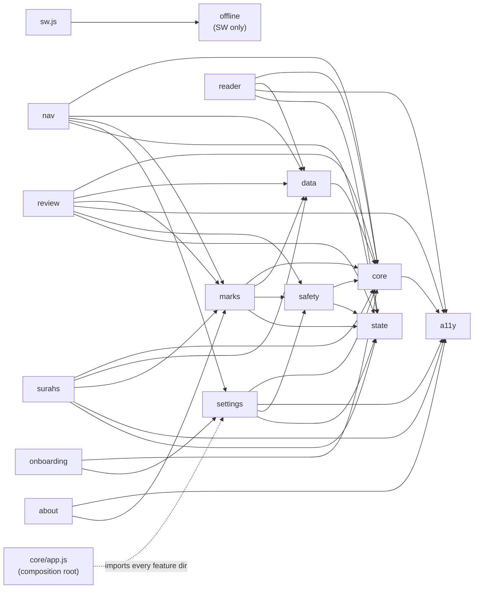

# Module Dependency Graph

Every top-level directory under `src/`, which files live in it, and which other directories it imports from / is imported by. Use this to answer "if I change X, what else breaks?" without grepping the whole tree.

**Key insight:** `core/` is the trunk, `a11y/` is a lone leaf, and `core/app.js` is the only file that cuts upward through layers (it's the composition root — see `architecture.md`).

## Mermaid overview

`core/app.js` imports from `settings`, `nav`, `marks`, `about`, `safety` as part of wiring. That's intentional — it's the entry point that composes everything. No other file in `core/` reaches upward. The composition-root dependency is drawn dashed so the diagram stays readable.

## Per-directory inventory

### `a11y/`
- **Files:** `announcer.js`
- **Imports from:** —
- **Imported by:** `about`, `core/quota-banner.js`, `marks/editor.js`, `reader`, `review`, `settings/clear-data.js`, `surahs`
- **Role:** Screen-reader live-region announcer (`announce(message)`).

### `about/`
- **Files:** `index.js`, `pwa-install.js`
- **Imports from:** `a11y`, `marks`
- **Imported by:** `core/app.js`
- **Role:** About page surface + PWA install prompt capture/handling.

### `core/`
- **Files:** `app.js`, `constants.js`, `db.js`, `events.js`, `logger.js`, `quota-banner.js`, `router.js`, `tag-colors.js`, `theme.css`, `ui.js`
- **Imports from:**
  - `core/app.js` → `a11y`, `about`, `marks`, `nav`, `safety`, `settings` *(composition root)*
  - `core/quota-banner.js` → `a11y`
  - Every other file: none outside core
- **Imported by:** **every feature directory** — this is the trunk.
- **Role:** Cross-cutting primitives. `db.js` (IDB), `events.js` (pub/sub), `router.js` (hash routing), `constants.js` (Events enum + shared constants), `logger.js` (noop wrapper in tests, console in prod), `ui.js` (undo toast), `tag-colors.js` (deterministic tag-color mapping), `quota-banner.js` (storage warnings). `theme.css` is the sole CSS file.

### `data/`
- **Files:** `dataset.js`, `offline.js`, `surah-meanings.js`
- **Imports from:** `core`
- **Imported by:** `marks`, `nav`, `reader`, `review`, `surahs`
- **Role:** Corpus fetch. `dataset.js::getSurahs()` + `getSurah(n)` serve the surah index and full surah payloads (cache-first via service worker). `offline.js` tracks activation state + dataset update flow. `surah-meanings.js` is the static mapping of surah-number → name meaning.

### `marks/`
- **Files:** `editor.js`, `indicator.js`, `store.js`, `tags.js`
- **Imports from:** `core`, `data`, `safety`
- **Imported by:** `about`, `core/app.js`, `nav`, `reader` *(via app.js hooks)*, `review`, `surahs`
- **Role:** Marks CRUD + UI. `store.js` is the IDB interface (save/delete/getAll/getByTag/getByVerseKey); `editor.js` is the bottom-sheet UI + long-press handler; `indicator.js` decorates bookmarked verses; `tags.js` exposes the seed tag palette.

### `nav/`
- **Files:** `ambient-dock.js`, `ambient-pill.js`, `command-sheet.js`, `more-sheet.js`
- **Imports from:** `core`, `data`, `marks`, `settings`
- **Imported by:** `core/app.js`
- **Role:** Navigation chrome. Dock + pill (ambient), command sheet (⌘K), more sheet (dock ⋯ parent).

### `offline/`
- **Files:** `dataset-updater.js`, `manifest-fetcher.js`, `sha256-verifier.js`, `staging-cache.js`
- **Imports from:** other files inside `offline/` only
- **Imported by:** **`src/sw.js` only** — this is service-worker-side code, not bundled into the client app.
- **Role:** SW dataset-update pipeline: fetch manifest, stage in a separate cache, SHA-256 verify, promote to live cache.

### `onboarding/`
- **Files:** `index.js`, `screens.js`
- **Imports from:** `core`, `settings`
- **Imported by:** `core/app.js` *(via dynamic import in `handleLaunchRestore`)*
- **Role:** First-run 4-screen walkthrough. Writes `settings.onboardingComplete`.

### `reader/`
- **Files:** `index.js`, `render.js`, `chunked-append.js`, `verse-scroll.js`, `position.js`, `edge-indicators.js`, `scroll-tracker.js`
- **Imports from:** `a11y`, `core`, `data`, `state`
- **Imported by:** `core/app.js` *(route handler — dynamic import)*
- **Role:** Main reading surface, split into focused modules:
  - `index.js` — route entry: fetch guard, compose render/position/indicators, cleanup orchestration.
  - `render.js` — DOM construction: verse chunks, surah header, basmala, end marker, skeleton, error state, invalid-verse notice.
  - `chunked-append.js` — scroll listener + rAF-throttled append of the next 50-verse chunk when the reader nears the bottom. Owns `CHUNK_SIZE`.
  - `verse-scroll.js` — `scrollVerseIntoView` alignment (3-rAF reflow) and `scrollToVerse` (lazy-renders chunks until target exists).
  - `position.js` — scroll/IntersectionObserver position tracking, `visibilitychange` flush, `DB_VISIBILITY_VISIBLE` re-scroll, deep-link target-verse handling. `savePosition` is the **sole writer** for the `positions` IDB store (CLAUDE.md Rule 5). Tracks current cleanups in a module-scoped registry so `teardownPositionTracking()` can dispose them on re-init.
  - `edge-indicators.js` — lazy left/right edge cue elements that flash on verse-number tap and emit `AMBIENT_SURFACE`.
  - `scroll-tracker.js` — observeScroll / observeNewVerses; computes the currently-visible verse for pill updates.
- **Internal imports:**
  - `index.js` → `render`, `chunked-append` (CHUNK_SIZE), `position`, `edge-indicators`, `scroll-tracker`
  - `position.js` → `scroll-tracker`, `chunked-append`, `verse-scroll`, `render` (invalid-verse notice)
  - `verse-scroll.js` → `render` (renderVerseChunk), `chunked-append` (CHUNK_SIZE), `scroll-tracker`
  - `chunked-append.js` → `render` (renderVerseChunk), `scroll-tracker`
  - `render.js`, `edge-indicators.js` → `core`, `state` only
- **Note:** does *not* import `marks/` directly — the `openEditor` / `setupLongPress` / `initIndicators` dependencies arrive via `hooks` injected by `router.register` in `app.js`. This keeps `reader/` independent of the marks subtree.

### `state/`
- **Files:** `ambient-chrome.js`, `command-sheet.js`, `mark-editor.js`, `reader.js`, `review.js`, `settings.js`, `surahs.js`, `sync.js`
- **Imports from:** — *(zero imports — pure data containers)*
- **Imported by:** `reader/index.js`, `review/hub.js`, `surahs/list.js`, `nav/command-sheet.js`, `nav/ambient-dock.js`, `nav/ambient-pill.js`, `marks/editor.js`, `settings/theme.js`, `settings/font-size.js`, `settings/panel.js`, `safety/sync.js`
- **Role:** Application state containers extracted from feature modules. Each module exposes `get()` → snapshot and `set(patch)` → `Object.assign`. No IDB access, no events, no DOM — pure in-memory data. Enables isolated unit testing of state transitions without mounting surfaces.

### `review/`
- **Files:** `hub.js`, `state.js`
- **Imports from:** `a11y`, `core`, `data`, `marks`, `safety`
- **Imported by:** `core/app.js` *(route handler for `#/review` and `#/t/:tag`)*
- **Role:** Both the review hub and FVR live in `hub.js` — `init()` branches on whether `params.tag` is set. `state.js` persists view/filter/sort/groupBy under `positions["review"]`.

### `safety/`
- **Files:** `input-validator.js`, `sync.js`
- **Imports from:** `core`
- **Imported by:** `marks`, `review`, `settings`
- **Role:** `input-validator.js::validateTagParam` gates URL-supplied tags (length + charset). `sync.js` is the BroadcastChannel bridge — mirrors mark writes across tabs and emits `SYNC_UPDATE_RECEIVED` on receipt; also listens for `DB_VERSION_CHANGE` and shows the versionchange reload banner.

### `settings/`
- **Files:** `clear-data.js`, `font-size.js`, `panel.js`, `theme.js`
- **Imports from:** `a11y`, `core`, `safety`
- **Imported by:** `core/app.js`, `nav/command-sheet.js`, `nav/more-sheet.js`, `onboarding/screens.js`
- **Role:** Per-preference modules wired together by `panel.js` (the bottom-sheet UI). `theme.js` owns the `data-theme` attribute + `prefers-color-scheme` listener for Auto. `font-size.js` handles rem-scale adjustments. `clear-data.js` owns the wipe confirmation + `deleteDB` call.

### `surahs/`
- **Files:** `list.js`
- **Imports from:** `a11y`, `core`, `data`, `marks`
- **Imported by:** `core/app.js` *(route handler for `#/surahs`)*
- **Role:** Surah directory with search / filters / continue-reading card.

### Root-level service-worker files
- **`src/sw.js`** and **`src/sw-handlers.js`** — service worker entry. Imports from `offline/` only (plus Workbox packages). Not part of the client bundle.

## Quick heuristics

- **Want to change persistence shape?** Touch `core/db.js` (stores + `validateWrite` table). Then propagate to `marks/store.js`, `review/state.js`, `settings/*`.
- **Want to add a route?** Register in `core/app.js`; create `src/<feature>/index.js` with an `async init(params, hooks)` export.
- **Want to add a cross-module signal?** Add to `core/constants.js::Events`. Emit from the owner, listen from consumers. Don't import the module directly — that's what the bus exists to avoid.
- **Want to wire a new piece of chrome?** Put it under `nav/`. It'll get bootstrapped from `app.js`.
- **Something under `reader/` needs `marks/` behavior?** Don't import — take it via `hooks` in `init(params, hooks)` and wire from `app.js`. Preserves the one-way dependency.
