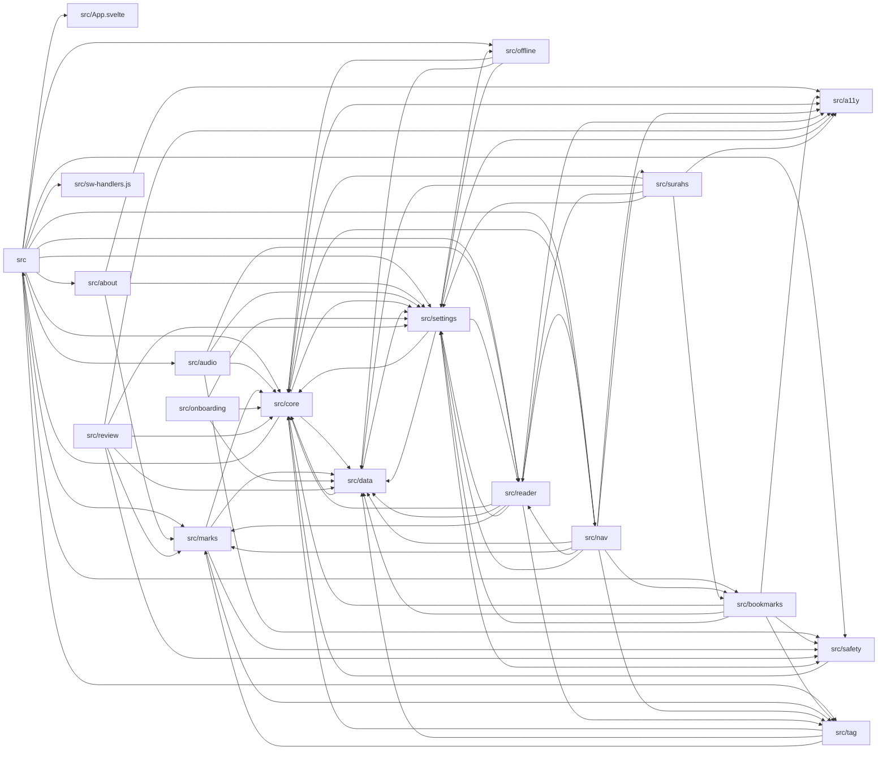

# Module graph

> AUTO-GENERATED from `src/**/*.{ts,js,svelte}` import statements. Run `pnpm docs:derive` to regenerate.

Top-level src directories: **19**.

## Mermaid (top-level)

<!-- AUTO-GENERATED:mermaid START -->

<!-- AUTO-GENERATED:mermaid END -->

## Per-directory

<!-- AUTO-GENERATED:dirs START -->
### `src`

- **Imports from:** `src/App.svelte`, `src/about`, `src/audio`, `src/bookmarks`, `src/core`, `src/marks`, `src/nav`, `src/offline`, `src/reader`, `src/safety`, `src/settings`, `src/sw-handlers.js`, `src/tag`
- **Imported by:** `src/core`

### `src/App.svelte`

- **Imports from:** _(none)_
- **Imported by:** `src`

### `src/a11y`

- **Imports from:** _(none)_
- **Imported by:** `src/about`, `src/bookmarks`, `src/core`, `src/nav`, `src/reader`, `src/review`, `src/settings`, `src/surahs`

### `src/about`

- **Imports from:** `src/a11y`, `src/marks`, `src/settings`
- **Imported by:** `src`

### `src/audio`

- **Imports from:** `src/core`, `src/reader`, `src/safety`, `src/settings`
- **Imported by:** `src`

### `src/bookmarks`

- **Imports from:** `src/a11y`, `src/core`, `src/data`, `src/safety`, `src/settings`, `src/tag`
- **Imported by:** `src`, `src/nav`, `src/surahs`

### `src/core`

- **Imports from:** `src`, `src/a11y`, `src/data`, `src/settings`
- **Imported by:** `src`, `src/audio`, `src/bookmarks`, `src/data`, `src/marks`, `src/nav`, `src/offline`, `src/onboarding`, `src/reader`, `src/review`, `src/safety`, `src/settings`, `src/surahs`, `src/tag`

### `src/data`

- **Imports from:** `src/core`, `src/settings`
- **Imported by:** `src/bookmarks`, `src/core`, `src/marks`, `src/nav`, `src/offline`, `src/onboarding`, `src/reader`, `src/review`, `src/settings`, `src/surahs`, `src/tag`

### `src/marks`

- **Imports from:** `src/core`, `src/data`, `src/safety`, `src/tag`
- **Imported by:** `src`, `src/about`, `src/nav`, `src/reader`, `src/review`, `src/tag`

### `src/nav`

- **Imports from:** `src/a11y`, `src/bookmarks`, `src/core`, `src/data`, `src/marks`, `src/reader`, `src/settings`, `src/surahs`, `src/tag`
- **Imported by:** `src`, `src/reader`

### `src/offline`

- **Imports from:** `src/core`, `src/data`, `src/settings`
- **Imported by:** `src`, `src/settings`

### `src/onboarding`

- **Imports from:** `src/core`, `src/data`, `src/settings`
- **Imported by:** _(none)_

### `src/reader`

- **Imports from:** `src/a11y`, `src/core`, `src/data`, `src/marks`, `src/nav`, `src/settings`, `src/tag`
- **Imported by:** `src`, `src/audio`, `src/nav`, `src/settings`, `src/surahs`

### `src/review`

- **Imports from:** `src/a11y`, `src/core`, `src/data`, `src/marks`, `src/safety`, `src/settings`
- **Imported by:** _(none)_

### `src/safety`

- **Imports from:** `src/core`
- **Imported by:** `src`, `src/audio`, `src/bookmarks`, `src/marks`, `src/review`, `src/settings`

### `src/settings`

- **Imports from:** `src/a11y`, `src/core`, `src/data`, `src/offline`, `src/reader`, `src/safety`
- **Imported by:** `src`, `src/about`, `src/audio`, `src/bookmarks`, `src/core`, `src/data`, `src/nav`, `src/offline`, `src/onboarding`, `src/reader`, `src/review`, `src/surahs`

### `src/surahs`

- **Imports from:** `src/a11y`, `src/bookmarks`, `src/core`, `src/data`, `src/reader`, `src/settings`
- **Imported by:** `src/nav`

### `src/sw-handlers.js`

- **Imports from:** _(none)_
- **Imported by:** `src`

### `src/tag`

- **Imports from:** `src/core`, `src/data`, `src/marks`
- **Imported by:** `src`, `src/bookmarks`, `src/marks`, `src/nav`, `src/reader`

<!-- AUTO-GENERATED:dirs END -->
