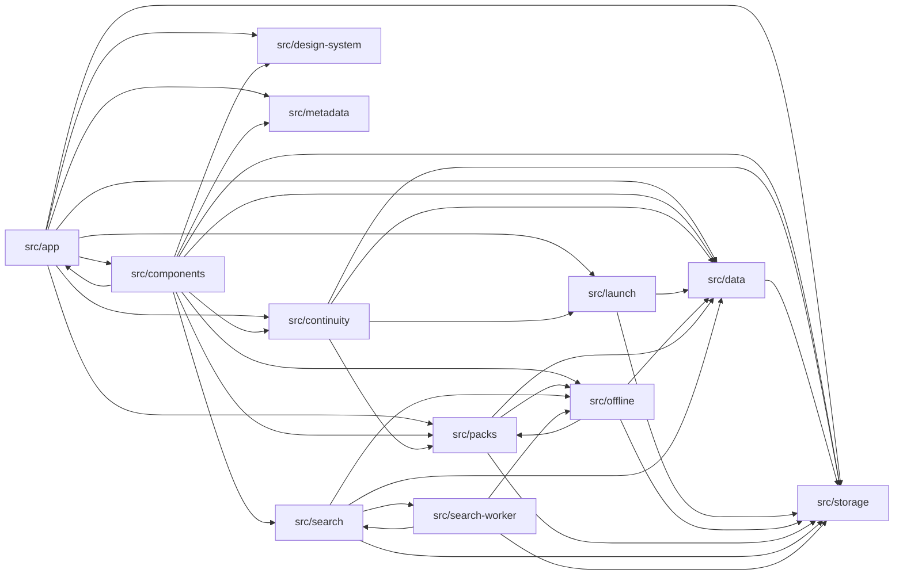

# Module graph

> AUTO-GENERATED from `src/**/*.{ts,tsx,js}` import statements. Run `pnpm run docs` to regenerate.

Top-level src directories: **12**.

## Mermaid (top-level)

<!-- AUTO-GENERATED:mermaid START -->

<!-- AUTO-GENERATED:mermaid END -->

## Per-directory

<!-- AUTO-GENERATED:dirs START -->
### `src/app`

- **Imports from:** `src/components`, `src/continuity`, `src/data`, `src/design-system`, `src/launch`, `src/metadata`, `src/packs`, `src/storage`
- **Imported by:** `src/components`

### `src/components`

- **Imports from:** `src/app`, `src/continuity`, `src/data`, `src/design-system`, `src/metadata`, `src/offline`, `src/packs`, `src/search`, `src/storage`
- **Imported by:** `src/app`

### `src/continuity`

- **Imports from:** `src/data`, `src/launch`, `src/packs`, `src/storage`
- **Imported by:** `src/app`, `src/components`

### `src/data`

- **Imports from:** `src/storage`
- **Imported by:** `src/app`, `src/components`, `src/continuity`, `src/launch`, `src/offline`, `src/packs`, `src/search`

### `src/design-system`

- **Imports from:** _(none)_
- **Imported by:** `src/app`, `src/components`

### `src/launch`

- **Imports from:** `src/data`, `src/storage`
- **Imported by:** `src/app`, `src/continuity`

### `src/metadata`

- **Imports from:** _(none)_
- **Imported by:** `src/app`, `src/components`

### `src/offline`

- **Imports from:** `src/data`, `src/packs`, `src/storage`
- **Imported by:** `src/components`, `src/packs`, `src/search`, `src/search-worker`

### `src/packs`

- **Imports from:** `src/data`, `src/offline`, `src/storage`
- **Imported by:** `src/app`, `src/components`, `src/continuity`, `src/offline`

### `src/search`

- **Imports from:** `src/data`, `src/offline`, `src/search-worker`, `src/storage`
- **Imported by:** `src/components`, `src/search-worker`

### `src/search-worker`

- **Imports from:** `src/offline`, `src/search`, `src/storage`
- **Imported by:** `src/search`

### `src/storage`

- **Imports from:** _(none)_
- **Imported by:** `src/app`, `src/components`, `src/continuity`, `src/data`, `src/launch`, `src/offline`, `src/packs`, `src/search`, `src/search-worker`

<!-- AUTO-GENERATED:dirs END -->
