# Source Data Flow

**Scope.** This is the single deep reference for the QuranAtlas source-data pipeline: source authorities, catalog policy, upstream source formats, normalization rules, build outputs, runtime consumption, and validation boundaries. Client code disagreements with this doc are bugs; build-time disagreements mean the scripts or catalog have drifted.

## Pipeline

The pipeline has seven stages:

1. `data/catalog/*.json` declares what sources and variant assets exist, where they come from, which are default, which are optional, and how they must be fetched and validated.
2. `scripts/data/sources/fetch.mjs` converts upstream payloads into committed normalized source files under `data/normalized/**`, using provider adapters under `scripts/data/sources/providers/`. Mushaf page assets are the exception: `scripts/data/mushaf-pages/import.mjs` optionally downloads quran.ws PDFs into `.scratch/` and converts them to generated local SVG inputs under `data/normalized/mushaf-pages/**`.
3. `scripts/data/text/build.mjs` validates normalized text sources and emits the reader corpus plus Quran text-style asset indexes under `public/dataset/**`.
4. `scripts/data/knowledge/build.mjs` validates curated Knowledge Lane sources and emits knowledge artifacts under `public/dataset/knowledge/**`.
5. `scripts/data/mushaf-pages/build.mjs` validates available generated SVG page packs and emits `public/dataset/mushaf-pages/{riwayah}/{mushafEditionId}/**`, legacy per-riwayah compatibility paths, and `indexes/mushaf-assets.json`.
6. `scripts/data/riwayah-packages/build.mjs` summarizes same-origin text/page package availability from `indexes/text-assets.json` and `indexes/mushaf-assets.json` into the temporary compatibility facade at `public/dataset/indexes/riwayah-packages.json`.
7. `scripts/data/manifest/inventory.mjs`, `src/data/dataset.ts`, `src/data/knowledge-dataset.ts`, the service worker, and offline settings consume only `/dataset/**` at runtime, with `manifest.json` carrying lane summaries plus per-file inventory entries.

Important boundary: `data/catalog/**`, `data/normalized/**`, and `data/taxonomy/**` are build-only. The app never reads them directly.
The browser never fetches quran.ws; quran.ws is used only by the optional import tool.

Qalun is the current MVP product qira'ah/riwayah pack. Existing runtime keys and paths continue to use `qaloon`; upstream source slugs such as `qalun` appear only in source-provider mapping context. Product prose should not present Qalun and `qaloon` as separate packs.

The current MVP build exposes only the default reader profile: Qaloon text/font, Qaloon Mushaf, and Bridges translation. Optional qira'ah/riwayah, translation, tafsir, curated metadata, Mushaf page, and search/index install-before-activate semantics are future multiple-profile work; the current asset UI is read-only inventory.

The runtime trust boundary is manifest membership plus build-time validation and local install-state verification. Per-file digest verification is not a current product claim.

React refactor code uses the same runtime trust boundary through
`src-react/data/runtime-boundary.ts`, `src-react/offline/**`, and
`src-react/packs/**`. Those modules define same-origin `/dataset/**` URL guards,
generic Cache Storage install plans, service-worker message contracts, and
edition-aware Mushaf pack contracts for future React surfaces. They are
React-only contracts during dual-build; they do not alter the shipped Svelte
service worker or the production `dist/` artifact. The React preview build emits
an isolated app-shell service worker into `dist-react/` only for proof commands;
same-origin dataset and Mushaf page bodies remain outside the React app shell.

Runtime ownership follows the same Reader First domain rule as the rest of `src/`: pack/source availability policy belongs in `src/packs/**`, continuity/restore rules belong in `src/continuity/**`, optional curated metadata adapters belong in `src/metadata/**`, and user-facing surfaces consume those helpers instead of inverting the dependency back into `src/read/**`, `src/navigate/**`, `src/configure/**`, or `src/onboard/**`.

```mermaid
flowchart TD
    subgraph Upstream["Upstream authorities"]
        KFGQPC["KFGQPC riwayah corpora"]
        QDB["Quran DB translation JSON"]
        QUL["QUL translation/tafsir API/resources"]
        QuranWs["quran.ws page PDFs"]
    end

    subgraph Catalog["Catalog and policy"]
        Authorities["data/catalog/authorities.json"]
        Licenses["data/catalog/licenses.json"]
        Rules["data/catalog/verification-rules.json"]
        QuranSources["data/catalog/quran-sources.json"]
        TranslationSources["data/catalog/translation-sources.json"]
        TafsirSources["data/catalog/tafsir-sources.json"]
        MushafPageCatalog["data/catalog/mushaf-pages.json"]
        QuranTextAssets["data/catalog/quran-text-assets.json"]
        MushafAssets["data/catalog/mushaf-assets.json"]
        RiwayahPackageCatalog["data/catalog/riwayah-packages.json"]
        CatalogValidator["scripts/data/sources/catalog.mjs"]
    end

    subgraph Normalize["Committed normalized inputs"]
        Fetcher["scripts/data/sources/fetch.mjs"]
        RiwayahSrc["data/normalized/quran/riwayat/{hafs,warsh,qaloon}.json"]
        TranslationSrc["data/normalized/translations/{id}.json"]
        TafsirSrc["data/normalized/tafsir/{id}.json"]
        ThemeTaxonomy["data/taxonomy/themes.json"]
        KnowledgePassagesSrc["data/normalized/knowledge/passages.json"]
        KnowledgeAyahThemesSrc["data/normalized/knowledge/ayah-themes.json"]
        MushafPageSrc["data/normalized/mushaf-pages/{riwayah}/pages/{NNN}.svg"]
    end

    subgraph Build["Offline dataset build"]
        VerseAliases["scripts/data/derive-verse-aliases.mjs"]
        VerseMap["public/dataset/translations/_verse-map.json"]
        TextBuild["scripts/data/text/build.mjs"]
        KnowledgeBuild["scripts/data/knowledge/build.mjs"]
        MushafPageBuild["scripts/data/mushaf-pages/build.mjs"]
        RiwayahPackageBuild["scripts/data/riwayah-packages/build.mjs"]
        ManifestBuild["scripts/data/manifest/inventory.mjs"]
        SourcesIndex["public/dataset/indexes/sources.json"]
        SourceAssets["public/dataset/indexes/source-assets.json"]
        RiwayahPackages["public/dataset/indexes/riwayah-packages.json"]
        Surahs["public/dataset/surahs.json"]
        Juz["public/dataset/juz.json"]
        RiwayahOut["public/dataset/riwayat/{riwayah}/{NNN}.json"]
        QuranTextOut["public/dataset/quran-text/{riwayah}/{textStyleId}/{NNN}.json"]
        TextAssetIndex["public/dataset/indexes/text-assets.json"]
        TranslationOut["public/dataset/translations/{id}/{NNN}.json"]
        TafsirOut["public/dataset/tafsir/{id}/{NNN}.json"]
        KnowledgeAyahOut["public/dataset/knowledge/ayah/{NNN}.json"]
        KnowledgePassagesOut["public/dataset/knowledge/passages/{NNN}.json"]
        KnowledgeIndexesOut["public/dataset/knowledge/indexes/*.json"]
        MushafPageOut["public/dataset/mushaf-pages/{riwayah}/{mushafEditionId}/**"]
        MushafAssetIndex["public/dataset/indexes/mushaf-assets.json"]
        Provenance["public/dataset/provenance.json"]
        Manifest["public/dataset/manifest.json"]
    end

    subgraph Runtime["Runtime readers"]
        DatasetApi["src/data/dataset.ts"]
        KnowledgeApi["src/data/knowledge-dataset.ts"]
        Reader["src/read/Reader.svelte"]
        Settings["riwayah/translation pickers"]
        Offline["src/data/offline.ts + offline selector"]
        SW["service worker route categories"]
    end

    Authorities --> CatalogValidator
    Licenses --> CatalogValidator
    Rules --> CatalogValidator
    QuranSources --> CatalogValidator
    TranslationSources --> CatalogValidator
    TafsirSources --> CatalogValidator
    MushafPageCatalog --> MushafPageBuild
    QuranTextAssets --> CatalogValidator
    MushafAssets --> CatalogValidator
    RiwayahPackageCatalog --> RiwayahPackageBuild

    QDB --> Fetcher
    QUL --> Fetcher
    QuranWs --> MushafPageSrc
    TranslationSources --> Fetcher
    TafsirSources --> Fetcher
    CatalogValidator --> Fetcher

    KFGQPC --> RiwayahSrc
    Fetcher --> TranslationSrc
    Fetcher --> TafsirSrc
    CatalogValidator --> TextBuild
    RiwayahSrc --> TextBuild
    TranslationSrc --> TextBuild
    TafsirSrc --> TextBuild
    VerseAliases --> TextBuild
    VerseMap --> TextBuild
    ThemeTaxonomy --> KnowledgeBuild
    KnowledgePassagesSrc --> KnowledgeBuild
    KnowledgeAyahThemesSrc --> KnowledgeBuild
    MushafPageSrc --> MushafPageBuild

    TextBuild --> SourcesIndex
    TextBuild --> SourceAssets
    TextBuild --> Surahs
    TextBuild --> Juz
    TextBuild --> RiwayahOut
    TextBuild --> QuranTextOut
    TextBuild --> TextAssetIndex
    TextBuild --> TranslationOut
    TextBuild --> TafsirOut
    TextBuild --> Provenance
    KnowledgeBuild --> KnowledgeAyahOut
    KnowledgeBuild --> KnowledgePassagesOut
    KnowledgeBuild --> KnowledgeIndexesOut
    MushafPageBuild --> MushafPageOut
    MushafPageBuild --> MushafAssetIndex
    TextAssetIndex --> RiwayahPackageBuild
    MushafAssetIndex --> RiwayahPackageBuild
    RiwayahPackageBuild --> RiwayahPackages
    SourcesIndex --> ManifestBuild
    SourceAssets --> ManifestBuild
    RiwayahPackages --> ManifestBuild
    Surahs --> ManifestBuild
    Juz --> ManifestBuild
    RiwayahOut --> ManifestBuild
    QuranTextOut --> ManifestBuild
    TextAssetIndex --> ManifestBuild
    TranslationOut --> ManifestBuild
    TafsirOut --> ManifestBuild
    KnowledgeAyahOut --> ManifestBuild
    KnowledgePassagesOut --> ManifestBuild
    KnowledgeIndexesOut --> ManifestBuild
    MushafPageOut --> ManifestBuild
    MushafAssetIndex --> ManifestBuild
    Provenance --> ManifestBuild
    ManifestBuild --> Manifest

    SourcesIndex --> DatasetApi
    SourceAssets --> Offline
    TextAssetIndex --> DatasetApi
    MushafAssetIndex --> DatasetApi
    RiwayahPackages --> DatasetApi
    RiwayahPackages --> Offline
    Surahs --> DatasetApi
    Juz --> DatasetApi
    RiwayahOut --> DatasetApi
    QuranTextOut --> DatasetApi
    TranslationOut --> DatasetApi
    TafsirOut --> DatasetApi
    Provenance --> DatasetApi
    Manifest --> DatasetApi
    KnowledgeAyahOut --> KnowledgeApi
    KnowledgePassagesOut --> KnowledgeApi
    KnowledgeIndexesOut --> KnowledgeApi

    DatasetApi --> Reader
    KnowledgeApi --> Reader
    DatasetApi --> Settings
    Manifest --> Offline
    MushafPageOut --> SW
    QuranTextOut --> SW
    SourcesIndex --> Offline
    RiwayahPackages --> SW
    Manifest --> SW
```



## Catalog Layer

`data/catalog/*.json` is QuranAtlas-owned metadata, not mirrored upstream payloads.

- `authorities.json`: upstream providers such as KFGQPC, Quran DB, and QUL.
- `licenses.json`: license records and approval status.
- `verification-rules.json`: allowed license statuses, allowed visibility values, and default source ids.
- `quran-sources.json`, `translation-sources.json`, `tafsir-sources.json`: individual source records.
- `mushaf-pages.json`: quran.ws page-asset policy, page count, riwayah slug mapping, and source PDF URL patterns.
- `quran-text-assets.json`: build-time variant contract for Quran text-style assets per riwayah. It records compatible defaults, provider/license identity, stable text-style ids, visibility, shipped status, provenance, and output templates under `quran-text/{riwayah}/{textStyleId}/{surah}.json`.
- `mushaf-assets.json`: build-time variant contract for Mushaf edition assets per riwayah. It records compatible defaults, quran.ws edition ids, provider/license identity, source slugs, page count, visibility, shipped status, and provenance.
- `riwayah-packages.json`: generated package index for the current Qaloon default profile. Hafs and Warsh can remain build-time source inputs for validation/future profiles but are not current runtime choices.

Each source record carries:

- identity: `id`, `type`, `label`, `language`
- governance: `providerId`, `licenseId`, `visibility`, `default`
- runtime metadata: `outputPath`, `sourceUrl`, QuranAtlas-owned `displayLabel`, `role`, `trustTier`, `sourceProvider`, `translator`
- fetch contract: `fetch.provider`, `fetch.normalizedPath`, plus provider-specific fields

`scripts/data/source-catalog.mjs` fails the pipeline when required provider, license, output path, visibility, fetch metadata, asset defaults, variant slugs, text output templates, Mushaf page counts, or quran.ws Mushaf source identity are missing or invalid.

## Upstream Source Formats And Normalization

### KFGQPC riwayah source

Source files are committed under `data/normalized/quran/riwayat/` and are treated as authoritative Arabic corpus inputs.

- Hafs format: flat array, one record per ayah, uses `sora`, includes `aya_text_emlaey`, `line_start`, and `line_end`.
- Warsh and runtime `qaloon` format: flat array, one record per ayah, use `sura_no`, do not carry `aya_text_emlaey`.

Build-time transformation in `scripts/data/build-dataset.mjs::splitRiwayah`:

- aliases `sora` and `sura_no` into one surah number
- groups the flat array into 114 per-surah payloads
- strips the trailing Arabic-Indic ayah number from `aya_text`
- keeps `id`, `line_start`, and `line_end` for Hafs only
- drops source-only fields with no runtime consumer

### Quran DB translation source

Quran DB translations arrive as a JSON object keyed by surah number. Each surah has metadata and an `Ayahs` object keyed by ayah number. The selected translation text is stored under a provider-specific field name, for Saheeh:

```json
{
  "1": {
    "SurahArabicName": "...",
    "SurahTransliteratedName": "...",
    "SurahEnglishNames": "...",
    "Ayahs": {
      "1": {
        "Umm Muhammad (Sahih International)": "In the name of Allah..."
      }
    }
  }
}
```

Normalization in `scripts/data/fetch-source.mjs::normalizeQuranDbTranslation`:

- validates that surah keys are numeric and ayah keys are contiguous from `1`
- reads only the configured field from catalog fetch metadata
- decodes HTML entities and collapses whitespace
- strips upstream HTML tags after entity decode; missing translation text is a hard failure
- emits the QuranAtlas monolithic normalized shape:
  - `translationId`
  - `translationVersion`
  - `fetchedAt`
  - `source`
  - `counts`
  - `surahs.{NNN}.verses[]`
  - `surahs.{NNN}.footnotes`
- initializes `intro: []` and `footnotes: {}`

The normalized translation remains Hafs-keyed. It is not re-keyed per riwayah.

### QUL translation source

Bridges uses QUL resource 179 because the Quran DB Bridges file is incomplete. The catalog record stores both QUL ids: `resourceId` for the public resource page and `contentResourceId` for the `api/v1/translations/{id}/by_range.json` API.

Normalization in `scripts/data/fetch-source.mjs::normalizeQulTranslationRows`:

- fetches all 114 Hafs-keyed surah ranges from QUL's translation `by_range.json` endpoint
- preserves authored translation text while stripping non-footnote HTML tags to plain text
- converts QUL `<sup foot_note=ID>N</sup>` markers into QuranAtlas `[N]` markers local to each surah
- resolves each upstream footnote id through QUL's `foot_notes/{id}` endpoint
- emits the same normalized monolithic shape as Quran DB translation sources, with populated `footnotes` maps when the source has footnotes

The normalized QUL translation remains Hafs-keyed. It is not re-keyed per riwayah.

### QUL tafsir source

QUL tafsir data is fetched from `by_range.json` endpoints and arrives as tafsir rows with a `verses` array and `text`, conceptually:

```json
{
  "tafsirs": [
    {
      "verses": ["2:1", "2:2", "2:3"],
      "text": "..."
    }
  ]
}
```

Normalization in `scripts/data/fetch-source.mjs::normalizeQulTafsirEntries`:

- preserves grouped tafsir ranges as one entry
- derives `startKey`, `endKey`, and full `ayahKeys`
- sets `sourceGranularity` to `range` when one tafsir text spans multiple ayat
- sorts entries by ayah order
The output is a committed monolithic tafsir source under `data/normalized/tafsir/{id}.json`.

### quran.ws Mushaf page source

Mushaf page assets use quran.ws vector page PDFs as upstream release inputs. The catalog maps:

- QuranAtlas `hafs` → quran.ws `hafs`
- QuranAtlas `warsh` → quran.ws `warsh`
- QuranAtlas `qaloon` → quran.ws `qalun`

`scripts/data/mushaf-pages/import.mjs` is an optional release/local tool. It downloads PDFs to `.scratch/mushaf-pages/pdfs/{riwayah}/` and converts each page with Poppler `pdftocairo` into `data/normalized/mushaf-pages/{riwayah}/pages/{NNN}.svg`. Those SVG inputs are generated artifacts and are gitignored by default.

`scripts/data/mushaf-pages/build.mjs` does not fetch quran.ws. It validates any available local SVG pack before emitting same-origin runtime assets. Unsafe SVG content is rejected, including scripts, `foreignObject`, inline event handlers, CSS imports, CSS `url(...)`, and external, `data:`, or `javascript:` hrefs. Emitted page SVGs are tokenized at build time by rewriting classified source `fill` and `stroke` colors to Mushaf CSS variables while preserving viewBox, path geometry, element order, IDs, same-document references, clipping, transforms, and opacity.

### Knowledge Lane sources

Knowledge Lane Phase 01 uses curated local sources only (no AI, embeddings, or generated claims):

- taxonomy: `data/taxonomy/themes.json`
- passages: `data/normalized/knowledge/passages.json`
- ayah-level themes: `data/normalized/knowledge/ayah-themes.json`

Validation and generation are handled by `scripts/data/knowledge/build.mjs`, which:

- validates theme ids, ayah keys, passage ranges, and range overlap constraints
- enforces approved-only runtime passage output
- emits deterministic per-surah knowledge shards and indexes

## Build Outputs

`scripts/data/text/build.mjs` consumes only committed normalized files, so the standard text dataset build is offline. It emits selectable translation/tafsir pack files and writes `indexes/source-assets.json` with byte totals for source-level downloads. `scripts/data/mushaf-pages/build.mjs` consumes only generated local SVG page artifacts and skips absent packs in clean checkouts. `scripts/data/riwayah-packages/build.mjs` then writes `indexes/riwayah-packages.json` from the built text/page outputs and refreshes `manifest.json` so the package index is a manifest member.

Profiles:

- `baseline`: emits `qaloon`, Bridges translation, metadata files, source indexes, and the Qalun (`qaloon`) page pack when the complete generated `qaloon` SVG range is present. Tafsir bodies and optional translation bodies are not current MVP runtime assets.
- `full`: future/release profile vocabulary for emitting every locally configured approved text source body and every available page pack for Hafs, Warsh, and Qalun (`qaloon`)
- `catalog`: emits metadata/index files without text bodies or page bodies

Selectable packs for this phase:

- translations: Bridges is the only current MVP translation source.
- tafsir: tafsir sources are future work and are not emitted as current MVP runtime packs.

Only the defaults (`bridges`, `muyassar`) are present in the baseline manifest / offline text plan. Optional packs stay discoverable through `indexes/sources.json`, are byte-planned by `indexes/source-assets.json`, and are fetched/cached on demand when the user selects or keeps them.

Generated runtime files:

- `public/dataset/riwayat/{riwayah}/{NNN}.json`
- `public/dataset/translations/{id}/{NNN}.json`
- `public/dataset/mushaf-pages/{riwayah}/manifest.json`
- `public/dataset/mushaf-pages/{riwayah}/pages/{NNN}.svg`
- `public/dataset/surahs.json`
- `public/dataset/juz.json`
- `public/dataset/indexes/sources.json`
- `public/dataset/indexes/source-assets.json`
- `public/dataset/indexes/riwayah-packages.json`
- `public/dataset/provenance.json`
- `public/dataset/manifest.json`

Knowledge lane runtime files (generated by `scripts/data/build-knowledge-dataset.mjs`):

- `public/dataset/knowledge/ayah/{NNN}.json`
- `public/dataset/knowledge/passages/{NNN}.json`
- `public/dataset/knowledge/indexes/theme-to-ayah.json`
- `public/dataset/knowledge/indexes/ayah-to-passage.json`
- `public/dataset/knowledge/indexes/passage-to-ayah.json`

Knowledge artifacts are emitted by `scripts/data/knowledge/build.mjs` and then inventoried by `scripts/data/manifest/inventory.mjs` into `public/dataset/manifest.json`, so the existing offline/update pipeline can cache them as part of the Text category without changing reader boot.

Mushaf page artifacts are emitted by `scripts/data/mushaf-pages/build.mjs` and inventoried as the `pages` manifest lane with category `pages`. Baseline product support is Qalun-only; the runtime/package key remains `qaloon`. Hafs and Warsh page packs are optional full-profile/release artifacts.

Validation performed during build:

- riwayah ayah totals match expected corpus totals
- `surahs.json` counts are derived from all three riwayat sources
- translation packs contain 114 surahs and Hafs-matching verse counts
- translation footnote markers and footnote maps are internally consistent
- tafsir entries have valid ayah keys and preserve grouped ranges
- `_verse-map.json` and `_verse-aliases.json` remain aligned with the riwayah corpus
- Mushaf page packs contain every page `001.svg` through `604.svg`, have a first-verse mapping and viewBox for every page, map spanning ayat to their start page for verse-to-page navigation, and contain only safe same-origin tokenized SVG content

## Runtime Consumption

`src/data/dataset.ts` is the runtime access layer. It reads only built files under `/dataset/**`.

- `getSurah(n)`: loads `/dataset/riwayat/{riwayah}/{NNN}.json`
- `getSurahs()`: loads `/dataset/surahs.json`
- `getTranslations()`: derives picker entries from `provenance.json`
- `loadTranslationForSurah(id, n)`: loads `/dataset/translations/{id}/{NNN}.json`
- `getSourceIndex()`: loads `/dataset/indexes/sources.json`
- `src/data/offline.ts::getSourceAssetManifest(kind, id)`: loads `/dataset/indexes/source-assets.json`
- Current shipped Svelte Mushaf page runtime modules may read legacy compatibility paths while the migration is in progress.
- React Mushaf modules must use only edition-aware paths: `/dataset/mushaf-pages/{riwayah}/{mushafEditionId}/manifest.json` and `/dataset/mushaf-pages/{riwayah}/{mushafEditionId}/pages/{NNN}.svg`.
- React builds must not copy Mushaf page SVG bodies into `dist-react/`; page packs are installed on demand through service-worker-owned asset-pack contracts.

`src/data/knowledge-dataset.ts` is the Phase 01 knowledge access layer:

- `loadAyahKnowledgeForSurah(n)`: loads `/dataset/knowledge/ayah/{NNN}.json`
- `loadPassagesForSurah(n)`: loads `/dataset/knowledge/passages/{NNN}.json`
- `getAyahKnowledge(key)`: returns per-ayah knowledge row or `null`
- `getThemesForAyah(key)`: returns zero-or-more theme rows
- `getPassageForAyah(key)`: resolves the approved passage or `null`

Package behavior is source-aware:

- unsupported saved Hafs/Warsh, non-Bridges translation, or tafsir settings are cleared by the MVP asset-contract reset before launch
- missing default Qaloon text, Qaloon Mushaf, or Bridges assets is a build/runtime error, not a source-picker fallback
- missing knowledge files resolve to `null` / empty rows without breaking reader rendering
- missing Mushaf page packs are a pack-availability state for the read surface, not a fallback to quran.ws

`indexes/sources.json` is narrowed to the current MVP text sources. Future optional body files can return through `indexes/source-assets.json` when multiple-profile install-before-activate UI is restored.

`indexes/riwayah-packages.json` is the compatibility package gate for the default Qaloon text plus Mushaf pages. Qalun is baseline-installed when those artifacts are present in the shipped dataset; the runtime key remains `qaloon`. Hafs and Warsh are not installable current MVP profiles.

## Translation Alignment Across Riwayat

Translations remain Hafs-keyed. Warsh and Qalun (`qaloon`) use Madinan numbering and sometimes differ from Hafs not only in counts but also in internal ayah boundaries.

Alignment is handled by:

- source file: `public/dataset/translations/_verse-aliases.json`
- builder: `scripts/data/derive-verse-aliases.mjs`
- runtime resolver: `src/data/verse-aliases.ts`

The alias table is derived from the Arabic corpus, not from translation text. It captures:

- count-divergent surahs
- equal-count surahs with internal boundary drift
- the Surah 1 Bismillah carve-out

Runtime resolver roles are:

- `identity`
- `merged`
- `primary`
- `continuation`
- `none`

This is what allows a Hafs-keyed translation to render correctly against Warsh and Qalun (`qaloon`) reader ayat.

## Offline And Service Worker Boundary

Offline caching and byte estimates are driven by the built dataset, not by normalized sources.

- route definitions live in `src/infra/sw/route-defs.ts`
- text routes are split into `text-core`, `text-riwayah`, `text-translation`, and `text-index`
- `indexes/riwayah-packages.json` is a `text-index` route and is cached in `CACHE_DATASET`
- page routes match `/dataset/mushaf-pages/{riwayah}/...`, cache with `CacheFirst`, and use per-riwayah cache names (`qa-pages-{riwayah}-v1`)
- legacy offline selector state is migration-only; current Asset Management is read-only inventory for the default profile

Only files present in `manifest.json` contribute to baseline download/update size. Optional source-pack caching is not current MVP UI.
Page files contribute to the `pages` lane only when the generated same-origin page pack exists in the current profile output.

## Verification

Key checks:

- `pnpm run data -- check`: validates source catalog integrity plus baseline text, knowledge, and any available local Mushaf page artifacts
- `pnpm run data -- build`: rebuilds the baseline runtime dataset and skips absent local Mushaf page artifacts with a warning
- `pnpm run data -- build --profile=full`: emits all approved local text source bodies and all available generated Mushaf page packs
- `pnpm run data -- mushaf-pages build --profile=baseline --require-riwayah=qaloon`: strict Qalun (`qaloon`) page-pack validation/release build
- `node scripts/data/validate-translation-mapping.mjs --check=A|B|C`: translation-alignment and source-audit checks

When changing fetch adapters, normalized source schema, build outputs, or runtime dataset loading, update this doc in the same change.
