# Source Data Flow

**Scope.** This is the single deep reference for the QuranAtlas text-data pipeline: source authorities, catalog policy, upstream source formats, normalization rules, build outputs, runtime consumption, and validation boundaries. Client code disagreements with this doc are bugs; build-time disagreements mean the scripts or catalog have drifted.

## Pipeline

The pipeline has four stages:

1. `data/catalog/*.json` declares what sources exist, where they come from, which are default, which are optional, and how they must be fetched and validated.
2. `scripts/data/fetch-source.mjs` converts upstream payloads into committed normalized source files under `data/normalized/**`.
3. `scripts/data/build-dataset.mjs` validates those normalized sources and emits the runtime dataset under `public/dataset/**`.
4. `src/data/dataset.ts`, the service worker, and offline settings consume only `/dataset/**` at runtime.

Important boundary: `data/catalog/**` and `data/normalized/**` are build-only. The app never reads them directly.

```mermaid
flowchart TD
    subgraph Upstream["Upstream authorities"]
        KFGQPC["KFGQPC riwayah corpora"]
        QDB["Quran DB translation JSON"]
        QUL["QUL tafsir API/resources"]
    end

    subgraph Catalog["Catalog and policy"]
        Authorities["data/catalog/authorities.json"]
        Licenses["data/catalog/licenses.json"]
        Rules["data/catalog/verification-rules.json"]
        QuranSources["data/catalog/quran-sources.json"]
        TranslationSources["data/catalog/translation-sources.json"]
        TafsirSources["data/catalog/tafsir-sources.json"]
        CatalogValidator["scripts/data/source-catalog.mjs"]
    end

    subgraph Normalize["Committed normalized inputs"]
        Fetcher["scripts/data/fetch-source.mjs"]
        RiwayahSrc["data/normalized/quran/riwayat/{hafs,warsh,qaloon}.json"]
        TranslationSrc["data/normalized/translations/{id}.json"]
        TafsirSrc["data/normalized/tafsir/{id}.json"]
        Pins["scripts/data/pins/*.sha256"]
    end

    subgraph Build["Offline dataset build"]
        VerseAliases["scripts/data/derive-verse-aliases.mjs"]
        VerseMap["public/dataset/translations/_verse-map.json"]
        BuildDataset["scripts/data/build-dataset.mjs"]
        SourcesIndex["public/dataset/indexes/sources.json"]
        Surahs["public/dataset/surahs.json"]
        Juz["public/dataset/juz.json"]
        RiwayahOut["public/dataset/riwayat/{riwayah}/{NNN}.json"]
        TranslationOut["public/dataset/translations/{id}/{NNN}.json"]
        TafsirOut["public/dataset/tafsir/{id}/{NNN}.json"]
        Provenance["public/dataset/provenance.json"]
        Manifest["public/dataset/manifest.json"]
    end

    subgraph Runtime["Runtime readers"]
        DatasetApi["src/data/dataset.ts"]
        Reader["src/reader/Reader.svelte"]
        Settings["riwayah/translation pickers"]
        Offline["src/data/offline.ts + offline selector"]
        SW["service worker route categories"]
    end

    Authorities --> CatalogValidator
    Licenses --> CatalogValidator
    Rules --> CatalogValidator
    QuranSources --> CatalogValidator
    TranslationSources --> CatalogValidator
    TafsirSources --> CatalogValidator

    QDB --> Fetcher
    QUL --> Fetcher
    TranslationSources --> Fetcher
    TafsirSources --> Fetcher
    CatalogValidator --> Fetcher

    KFGQPC --> RiwayahSrc
    Fetcher --> TranslationSrc
    Fetcher --> TafsirSrc
    Fetcher --> Pins

    CatalogValidator --> BuildDataset
    RiwayahSrc --> BuildDataset
    TranslationSrc --> BuildDataset
    TafsirSrc --> BuildDataset
    VerseAliases --> BuildDataset
    VerseMap --> BuildDataset

    BuildDataset --> SourcesIndex
    BuildDataset --> Surahs
    BuildDataset --> Juz
    BuildDataset --> RiwayahOut
    BuildDataset --> TranslationOut
    BuildDataset --> TafsirOut
    BuildDataset --> Provenance
    BuildDataset --> Manifest

    SourcesIndex --> DatasetApi
    Surahs --> DatasetApi
    Juz --> DatasetApi
    RiwayahOut --> DatasetApi
    TranslationOut --> DatasetApi
    TafsirOut --> DatasetApi
    Provenance --> DatasetApi
    Manifest --> DatasetApi

    DatasetApi --> Reader
    DatasetApi --> Settings
    Manifest --> Offline
    SourcesIndex --> Offline
    Manifest --> SW
```



## Catalog Layer

`data/catalog/*.json` is QuranAtlas-owned metadata, not mirrored upstream payloads.

- `authorities.json`: upstream providers such as KFGQPC, Quran DB, and QUL.
- `licenses.json`: license records and approval status.
- `verification-rules.json`: allowed license statuses, allowed visibility values, and default source ids.
- `quran-sources.json`, `translation-sources.json`, `tafsir-sources.json`: individual source records.

Each source record carries:

- identity: `id`, `type`, `label`, `language`
- governance: `providerId`, `licenseId`, `visibility`, `default`
- integrity: `sourceChecksum`
- runtime metadata: `outputPath`, `sourceUrl`
- fetch contract: `fetch.provider`, `fetch.normalizedPath`, `fetch.pinPath`, plus provider-specific fields

`scripts/data/source-catalog.mjs` fails the pipeline when required provider, license, checksum, output path, visibility, or fetch metadata is missing or invalid.

## Upstream Source Formats And Normalization

### KFGQPC riwayah source

Source files are committed under `data/normalized/quran/riwayat/` and are treated as authoritative Arabic corpus inputs.

- Hafs format: flat array, one record per ayah, uses `sora`, includes `aya_text_emlaey`, `line_start`, and `line_end`.
- Warsh and Qaloon format: flat array, one record per ayah, use `sura_no`, do not carry `aya_text_emlaey`.

Build-time transformation in `scripts/data/build-dataset.mjs::splitRiwayah`:

- aliases `sora` and `sura_no` into one surah number
- groups the flat array into 114 per-surah payloads
- strips the trailing Arabic-Indic ayah number from `aya_text`
- keeps `id`, `line_start`, and `line_end` for Hafs only
- drops source-only fields with no runtime consumer

### Quran DB translation source

Quran DB translations arrive as a JSON object keyed by surah number. Each surah has metadata and an `Ayahs` object keyed by ayah number. The selected translation text is stored under a provider-specific field name, for Saheeh:

```json
{
  "1": {
    "SurahArabicName": "...",
    "SurahTransliteratedName": "...",
    "SurahEnglishNames": "...",
    "Ayahs": {
      "1": {
        "Umm Muhammad (Sahih International)": "In the name of Allah..."
      }
    }
  }
}
```

Normalization in `scripts/data/fetch-source.mjs::normalizeQuranDbTranslation`:

- validates that surah keys are numeric and ayah keys are contiguous from `1`
- reads only the configured field from catalog fetch metadata
- decodes HTML entities and collapses whitespace
- emits the QuranAtlas monolithic normalized shape:
  - `translationId`
  - `translationVersion`
  - `fetchedAt`
  - `source`
  - `counts`
  - `surahs.{NNN}.verses[]`
  - `surahs.{NNN}.footnotes`
- initializes `intro: []` and `footnotes: {}`

The normalized translation remains Hafs-keyed. It is not re-keyed per riwayah.

### QUL tafsir source

QUL tafsir data is fetched from `by_range.json` endpoints and arrives as tafsir rows with a `verses` array and `text`, conceptually:

```json
{
  "tafsirs": [
    {
      "verses": ["2:1", "2:2", "2:3"],
      "text": "..."
    }
  ]
}
```

Normalization in `scripts/data/fetch-source.mjs::normalizeQulTafsirEntries`:

- preserves grouped tafsir ranges as one entry
- derives `startKey`, `endKey`, and full `ayahKeys`
- sets `sourceGranularity` to `range` when one tafsir text spans multiple ayat
- sorts entries by ayah order
- writes a normalized `sourceChecksum`

The output is a committed monolithic tafsir source under `data/normalized/tafsir/{id}.json`.

## Build Outputs

`scripts/data/build-dataset.mjs` consumes only committed normalized files, so the standard dataset build is offline.

Profiles:

- `baseline`: emits `qaloon`, `saheeh`, `muyassar`, plus metadata files
- `full`: emits every locally configured approved source body
- `catalog`: emits metadata/index files without text bodies

Generated runtime files:

- `public/dataset/riwayat/{riwayah}/{NNN}.json`
- `public/dataset/translations/{id}/{NNN}.json`
- `public/dataset/tafsir/{id}/{NNN}.json`
- `public/dataset/surahs.json`
- `public/dataset/juz.json`
- `public/dataset/indexes/sources.json`
- `public/dataset/provenance.json`
- `public/dataset/manifest.json`

Validation performed during build:

- riwayah ayah totals match expected corpus totals
- `surahs.json` counts are derived from all three riwayat sources
- translation packs contain 114 surahs and Hafs-matching verse counts
- translation footnote markers and footnote maps are internally consistent
- tafsir entries have valid ayah keys and preserve grouped ranges
- `_verse-map.json` and `_verse-aliases.json` remain aligned with the riwayah corpus

## Runtime Consumption

`src/data/dataset.ts` is the runtime access layer. It reads only built files under `/dataset/**`.

- `getSurah(n)`: loads `/dataset/riwayat/{riwayah}/{NNN}.json`
- `getSurahs()`: loads `/dataset/surahs.json`
- `getTranslations()`: derives picker entries from `provenance.json`
- `loadTranslationForSurah(id, n)`: loads `/dataset/translations/{id}/{NNN}.json`
- `getSourceIndex()`: loads `/dataset/indexes/sources.json`
- `getTafsirs()`: derives tafsir entries from the source index
- `loadTafsirForSurah(id, n)`: loads `/dataset/tafsir/{id}/{NNN}.json`

Fallback behavior is source-aware:

- missing saved riwayah falls back to `qaloon`
- missing saved translation falls back to `saheeh`
- missing saved tafsir falls back to `muyassar`

`indexes/sources.json` may list optional sources whose bodies are absent from `manifest.json`. That is intentional. It allows runtime discovery and offline planning without inflating the baseline artifact.

## Translation Alignment Across Riwayat

Translations remain Hafs-keyed. Warsh and Qaloon use Madinan numbering and sometimes differ from Hafs not only in counts but also in internal ayah boundaries.

Alignment is handled by:

- source file: `public/dataset/translations/_verse-aliases.json`
- builder: `scripts/data/derive-verse-aliases.mjs`
- runtime resolver: `src/data/verse-aliases.ts`

The alias table is derived from the Arabic corpus, not from translation text. It captures:

- count-divergent surahs
- equal-count surahs with internal boundary drift
- the Surah 1 Bismillah carve-out

Runtime resolver roles are:

- `identity`
- `merged`
- `primary`
- `continuation`
- `none`

This is what allows a Hafs-keyed translation to render correctly against Warsh and Qaloon reader ayat.

## Offline And Service Worker Boundary

Offline caching and byte estimates are driven by the built dataset, not by normalized sources.

- route definitions live in `src/core/sw/route-defs.ts`
- text routes are split into `text-core`, `text-riwayah`, `text-translation`, `text-tafsir`, and `text-index`
- offline selector state stores source-aware text selections under `settings.offlineCategories.text.{riwayat,translations,tafsir}`

Only files present in `manifest.json` contribute to baseline download size. Optional entries listed in `indexes/sources.json` stay metadata-only until their bodies are emitted by a build profile.

## Verification

Key checks:

- `pnpm run check:source-catalog`: validates source catalog integrity and policy
- `pnpm run build:dataset`: rebuilds the baseline runtime dataset
- `pnpm run build:dataset:full`: emits all approved local source bodies
- `node scripts/data/validate-translation-mapping.mjs --check=A|B|C`: translation-alignment and source-audit checks

When changing fetch adapters, normalized source schema, build outputs, or runtime dataset loading, update this doc in the same change.
