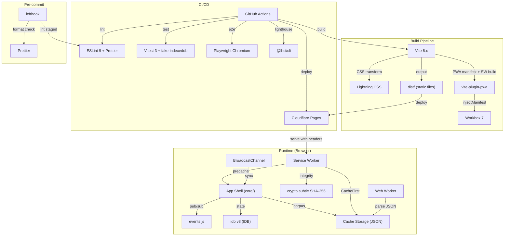

# Tech Stack Decision Record (TDR)

**Project:** QuranAtlas
**Date:** 2026-03-29
**Status:** Finalised

---

## 1. Tech Stack Table

| Domain               | Chosen Technology                   | Version/Tier              | Justification                                                                                                                              |
| -------------------- | ----------------------------------- | ------------------------- | ------------------------------------------------------------------------------------------------------------------------------------------ |
| **Language**         | Vanilla JS ES2022+                  | ES2022 target             | Plan requirement: lowest runtime overhead; no framework, no TypeScript                                                                     |
| **Build**            | Vite                                | 6.x (upgrade path to 8.x) | ESM-native, `manualChunks` for 6-chunk split, `injectManifest` PWA support; only build tool with all three (scored 32/35 vs esbuild 22/35) |
| **CSS**              | Lightning CSS via Vite built-in     | Vite-integrated           | Zero runtime overhead; CSS nesting compilation for safety; 100x faster minification than PostCSS; one config line in `vite.config.js`      |
| **PWA**              | vite-plugin-pwa + Workbox 7         | Workbox 7.4.x             | Mature `injectManifest` mode; custom SW for dataset caching + Background Fetch; Workbox actively maintained by Chrome Aurora team          |
| **IDB**              | idb                                 | v8.0.x                    | ~1.2 kB brotli; ESM-only; thin Promise wrapper; full cursor/multiEntry support; 18x smaller than Dexie                                     |
| **Corpus Storage**   | Cache Storage (browser API)         | Native                    | <25 ms read path vs 200-500 ms IDB for 6,236 records; gzip-compressed on disk; SW integration is seamless                                  |
| **Unit Tests**       | Vitest                              | 3.x                       | ESM-native; Vite HMR integration; v8 coverage; fake-indexeddb compatible (scored 4.9/5 vs Jest 3.1/5)                                      |
| **E2E Tests**        | Playwright                          | 1.x (Chromium only)       | SW offline simulation; IDB inspection; `context.setOffline()`; Cypress disqualified (cannot test SW offline)                               |
| **Lighthouse CI**    | @lhci/cli                           | 0.15.x                    | Purpose-built for CI threshold enforcement; better maintained than playwright-lighthouse                                                   |
| **IDB Mock**         | fake-indexeddb                      | 6.x                       | multiEntry, openKeyCursor, nextunique all supported; 620K weekly downloads; active maintenance                                             |
| **Linter**           | ESLint v9 flat config               | 9.x                       | Plan requirement; security rules (no-eval, no-unsanitized, no-localStorage); unicorn selective                                             |
| **Formatter**        | Prettier                            | 3.x/4.x                   | Industry standard; zero-config; `eslint-config-prettier` resolves conflicts (scored 22/25)                                                 |
| **Pre-commit**       | lefthook                            | Latest                    | Single dependency; built-in staged-file filtering; YAML config; cleaner than husky+lint-staged for small projects                          |
| **Hosting**          | Cloudflare Pages                    | Free tier                 | Zero injected scripts (CSP-safe); unlimited bandwidth; Brotli; `_headers` for CSP/cache control (scored 5.0/5)                             |
| **CI/CD**            | GitHub Actions                      | Free (public repo)        | Unlimited minutes for public repos; best Playwright/LHCI tooling; native CF Pages deployment                                               |
| **Dataset Hosting**  | Bundled in static site              | Same-origin               | 2 MB is trivial; eliminates CORS; atomic deploy with app; no R2/CDN operational overhead                                                   |
| **Cross-tab Sync**   | BroadcastChannel + visibilitychange | Native APIs               | Chrome Android 12+ full support; SharedWorker disqualified (no Android Chrome support)                                                     |
| **Node.js**          | Node.js 22 LTS                      | 22.x                      | ESM-native; structuredClone; managed via `.nvmrc` + `engines` field                                                                        |
| **Arabic Font**      | KFGQPC Uthman Taha Naskh            | WOFF2 (~280 KB)           | Required by PUA-encoded quran.com corpus; redistribution confirmed                                                                         |
| **Translation Font** | Noto Naskh Arabic                   | System fallback           | OFL; covers Arabic UI block                                                                                                                |

---

## 2. Rejected Alternatives

| Domain      | Rejected                         | Reason                                                                                                                           |
| ----------- | -------------------------------- | -------------------------------------------------------------------------------------------------------------------------------- |
| Build       | esbuild (direct)                 | No `manualChunks` API (open issue since 2020); dealbreaker for 6-chunk splitting requirement                                     |
| Build       | Parcel 2                         | Declining ecosystem; no fine-grained chunk control; no first-class `injectManifest` PWA support                                  |
| CSS         | PostCSS (nesting + custom media) | 3-4 extra dependencies + config file; Lightning CSS does the same in one Vite config line, 100x faster                           |
| CSS         | Plain CSS files                  | Viable but no build-time nesting compilation safety net; no advanced minification                                                |
| PWA         | Serwist (Workbox fork)           | Workbox 7 is actively maintained; switching trades larger ecosystem for marginal ESM-only benefit                                |
| PWA         | Custom SW (no Workbox)           | High reimplementation effort for precache, routing, expiration; unjustified for a personal project                               |
| IDB         | Dexie.js 4                       | 26 kB gzipped (18x larger than idb); ORM features unnecessary for 5 simple stores                                                |
| IDB         | Raw IndexedDB API                | Callback-heavy; 2-3x more code; high bug surface; idb's 1.2 kB cost is negligible                                                |
| Unit Test   | Jest 30                          | ESM still experimental (`--experimental-vm-modules`); no Vite HMR integration; fake-indexeddb needs manual structuredClone setup |
| Unit Test   | Node.js native test runner       | No jsdom environment; no Vite integration; no coverage threshold enforcement                                                     |
| E2E         | Cypress 13+                      | **Disqualified**: cannot test Service Worker offline mode (issue #16192 open since 2021); SW breaks Cypress panel                |
| E2E         | WebdriverIO 8+                   | Viable but no advantages over Playwright; slower; less mature SW testing                                                         |
| Lighthouse  | playwright-lighthouse            | Last published 2+ years ago; stale maintenance; risk of breaking with newer Playwright                                           |
| Hosting     | GitHub Pages                     | No custom HTTP headers (CSP via meta tag only); 10-min cache TTL on SW file delays updates                                       |
| Hosting     | Netlify                          | Injects analytics scripts that can violate `script-src 'self'`; no free-tier Brotli                                              |
| Hosting     | Vercel                           | Serverless-first platform; unnecessary complexity for a static PWA                                                               |
| Dataset CDN | Cloudflare R2 (separate CDN)     | Adds CORS complexity, cross-origin cache management, version mismatch risk; 2 MB dataset doesn't warrant separate infra          |
| Pre-commit  | husky + lint-staged              | Two packages; husky has had breaking changes across major versions; lefthook is simpler                                          |
| Cross-tab   | SharedWorker                     | **Not supported on Chrome Android** (primary target); disqualified                                                               |
| Cross-tab   | localStorage `storage` event     | Banned by project architecture (no localStorage)                                                                                 |

---

## 3. Integration Map



---

## 4. Open Questions

| #   | Question                                                                                            | Impact                                                                                                     | Suggested Resolution                                                   |
| --- | --------------------------------------------------------------------------------------------------- | ---------------------------------------------------------------------------------------------------------- | ---------------------------------------------------------------------- |
| 1   | **Domain name** — has a domain been purchased for QuranAtlas?                                       | Affects Cloudflare Pages custom domain setup                                                               | If no domain yet, `quran-atlas.pages.dev` works as a free default      |
| 2   | **Public or private repo?**                                                                         | GitHub Actions minutes (unlimited for public, 2000/mo for private); non-commercial license suggests public | Recommend public repo given CC BY-NC-ND constraint                     |
| 3   | **Vite 8.x upgrade timing** — Vite 8 (Rolldown) released 2026-03-12; start with 6.x or jump to 8.x? | Build speed (10-30x faster with Rolldown); potential plugin compat issues                                  | Start with 6.x; evaluate 8.x after 2-3 patch releases (April/May 2026) |
| 4   | **Tag label max length** — plan says "bounded" but no number                                        | Affects IDB schema, UI layout                                                                              | Recommend 50 characters                                                |
| 5   | **Note body max length** — not specified                                                            | Same                                                                                                       | Recommend 2000 characters                                              |
| 6   | **quran.com API key** — is one needed for the dataset build script?                                 | Build-time only; doesn't affect runtime                                                                    | Check API docs; fallback to quran-json GitHub repo                     |
| 7   | **Web Locks API for dataset updates** — add as Phase 3 complement?                                  | Prevents concurrent dataset downloads across tabs                                                          | Recommend adding; low effort, high safety                              |

---

## 5. Risk Register

| Risk                                        | Likelihood              | Impact | Mitigation                                                                                                                                                  |
| ------------------------------------------- | ----------------------- | ------ | ----------------------------------------------------------------------------------------------------------------------------------------------------------- |
| **Vite 6.x reaches EOL before Phase 3**     | Medium                  | Medium | Upgrade to Vite 8.x is straightforward for a vanilla JS app; no framework plugins to break; monitor deprecation timeline                                    |
| **CSP violation from Vite inline scripts**  | High (if misconfigured) | High   | `build.modulePreload.polyfill: false` MUST be set; add E2E test asserting zero inline scripts in built HTML                                                 |
| **Cloudflare Pages free tier changes**      | Low                     | Medium | Dataset is static files; trivially migratable to any static host; `_headers` pattern works on Netlify too                                                   |
| **Workbox 7 maintenance stalls**            | Low                     | Medium | Serwist fork is a drop-in alternative; `injectManifest` pattern is stable                                                                                   |
| **fake-indexeddb diverges from spec**       | Low                     | Low    | Well-maintained (runs W3C Web Platform Tests); alternative: browser-mode testing in Vitest                                                                  |
| **IDB storage eviction before PWA install** | Medium                  | High   | `navigator.storage.persist()` after first user gesture; encourage install; show non-blocking warning if denied; check `persisted()` before offline download |
| **KFGQPC font license revision**            | Very Low                | High   | Redistribution currently confirmed; fallback: Scheherazade New (OFL) + Tanzil Uthmani corpus (CC BY 3.0)                                                    |
| **Prettier/ESLint conflict**                | Low                     | Low    | `eslint-config-prettier` disables all conflicting rules; well-tested integration                                                                            |
| **lefthook unfamiliar to contributors**     | Low                     | Low    | Single YAML config; clear docs; fallback to husky+lint-staged if needed                                                                                     |

---

## 6. Dev Dependencies Summary

```
# Core build
vite@^6
lightningcss         # CSS transformer (Vite peer dep)
vite-plugin-pwa      # PWA + Workbox integration

# Runtime (vendor chunk)
idb@^8               # IndexedDB wrapper (~1.2 kB brotli)

# Linting & Formatting
eslint@^9
eslint-plugin-no-unsanitized
eslint-plugin-unicorn
eslint-config-prettier
globals              # Environment globals for flat config
prettier

# Testing
vitest@^3
fake-indexeddb@^6
@vitest/coverage-v8
playwright@^1
@lhci/cli

# DX
lefthook
```

**Estimated total `node_modules` footprint:** ~150-200 MB (dominated by Playwright browsers).
**Estimated vendor chunk:** <5 kB gzip (idb only).
